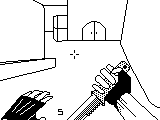

### [ricardotecpro.github.io](https://ricardotecpro.github.io/)

# Apresentação da disciplina de linguagem de programação 💻

---

## 🤔 Quem sou eu?

### Experiência profissional

<!-- --- -->

## 👋 Apresentação dos alunos

Para que possamos nos conhecer melhor, por favor, compartilhe um pouco sobre você:

* **Nome:**
* **Cidade:**
* **Trabalha na área de TI?** (Sim/Não. Se sim, qual função?)
* **Qual seu principal objetivo para este ano?**
* **Já se identifica com alguma área específica da TI?** (Ex: Desenvolvimento Web, Mobile, Banco de Dados, Redes, Segurança, IA, etc.)

---

## 🎓 Plano de curso

**Instituição:** Fundação

### Objetivo geral
A disciplina visa:
* Aprofundar nos conceitos de **Orientação a Objetos** utilizando C/C++.
* Aplicar conhecimentos de **Programação WEB**.
* Utilizar **frameworks** para o desenvolvimento de soluções WEB.
* Desenvolver uma **visão sistêmica** da comunicação entre diferentes soluções de software.

---

### 📚 Conteúdo programático

O curso será dividido nos seguintes módulos principais:

**1. Conceitos de Linguagem C++ e Programação Orientada a Objetos (POO)**
* 1.1. Revisão dos comandos básicos de C++
* 1.2. Programação Orientada a Objetos com C++:
* 1.2.1. Classes
* 1.2.2. Objetos
* 1.2.3. Construtores
* 1.2.4. Métodos de Acesso (Getters)
* 1.2.5. Métodos Modificadores (Setters)
* 1.2.6. Objetos Constantes
* 1.2.7. Herança
* 1.2.8. Polimorfismo
* 1.2.9. Agregação
* 1.2.10. Composição
* 1.2.11. Interfaces (Classes Abstratas Puras)
* 1.3. Desenvolvimento de Aplicações usando conceitos de POO em C++

**2. Programação WEB**
* 2.1. Conceitos de Programação WEB
* 2.2. Criação de Formulários WEB
* 2.3. Acesso a Banco de Dados
* 2.4. Manipulação de Controles e Eventos
* 2.5. Manutenção de Estados (variáveis de sessão, cookies, etc.)
* 2.6. Troca de Valores entre páginas (ex: PostBack, QueryString)
* 2.7. Criação de Menus de navegação
* 2.8. Criação e aplicação de Estilos (CSS)
* 2.9. Controle de Acesso (LOGIN e autenticação)
* 2.10. Desenvolvimento de Aplicações WEB aplicando conceitos de POO

**3. Frameworks de Desenvolvimento**
* 3.1. Conceitos de Frameworks
* 3.2. Conceitos de Arquiteturas de software (Monolítica, Microserviços, etc.)
* 3.3. Conceitos de Programação em Camadas (N-Tier Architecture)
* 3.4. Framework de Arquitetura MVC (Model-View-Controller)
* 3.5. Conceitos de Persistência de Dados
* 3.6. Framework ORM (Object-Relational Mapping)
* 3.7. Conceitos de Rotas em aplicações web
* 3.8. Conceitos de Autenticação e Autorização em frameworks
* 3.9. Conceitos de Linguagem Estruturada de Consulta (SQL) e sua integração
* 3.10. Desenvolvimento de Aplicações usando Frameworks

**4. Desenvolvimento de Aplicações Single Page Application (SPA)**
* 4.1. Conceitos de Aplicações SPA
* 4.2. Conceitos de Arquitetura MVVM (Model-View-ViewModel) e outras arquiteturas SPA
* 4.3. Conceitos de Aplicações Bloqueantes e Não Bloqueantes (Asynchronous Operations)
* 4.4. Conceitos de Desenvolvimento de Componentes reutilizáveis
* 4.5. Conceitos de Serviços WEB (Web Services)
* 4.6. Conceitos de Serviços REST (Representational State Transfer)
* 4.7. Implementação de Serviços REST (APIs)
* 4.8. Implementação de aplicações SPA consumindo serviços REST
* 4.9. Desenvolvimento de aplicações SPA completas

---

### 🛠️ Linguagens e ferramentas

Durante o curso, exploraremos e utilizaremos as seguintes tecnologias:

* **C++**
* **Java**
* **Python**
* **JavaScript**
* (Outras ferramentas e IDEs específicas serão usadas conforme necessário)

---

### 📝 Atividades

As atividades da disciplina incluirão:

1.  Resolução de exercícios práticos.
2.  Elaboração de novos exercícios e desafios.
3.  Pesquisas individuais e em grupo, abordando aspectos teóricos do conteúdo programático.
4.  Apresentação de seminários sobre temas relevantes.
5.  Desenvolvimento de trabalhos práticos, individualmente ou em grupos.
6.  Elaboração de programas e pequenas aplicações.

---

### 💯 Avaliação

O desempenho dos alunos será avaliado por meio de:

1.  **Provas escritas ou práticas:** Avaliações formais sobre o conteúdo ministrado.
2.  **Trabalhos e/ou seminários:** Avaliação contínua do aprendizado através de projetos, apresentações e participação.

---

### 📖 Bibliografia básica

* GREENE, Jennifer. **Use A Cabeça! C#**. Rio de Janeiro: Alta Books, 2011. (Embora o foco seja C++, este livro pode oferecer insights sobre POO de forma didática)
* SAVITCH, Walter J. **C++ Absoluto**. São Paulo: Addison Wesley, 2004.
* MATOS, Ecivaldo; ZABOT, Diego. **Aplicativos com Bootstrap e Angular : como desenvolver apps responsivos**. São Paulo: Érica, 2020.
* MILETTO, Evandro Manara, BERTAGNOLLI, Silvia Castro. **Desenvolvimento de Software II**. Porto Alegre : Bookman, 2014.

*(Bibliografia complementar poderá ser indicada durante o curso.)*

---

<!--

## 🌐 Moodle

**INSCREVA-SE NA PLATAFORMA:**

* **Curso:** Linguagem de Programação - ADS - 2 - Turma ? (LPADST2)
* **Chave de Inscrição:** `INFO202?`

---
## 📅 Cronograma
O cronograma detalhado das aulas será disponibilizado na plataforma Moodle, incluindo datas, horários e conteúdos a serem abordados em cada aula.

## 📞 Contato

Para dúvidas ou mais informações, entre em contato pelo e-mail:

-->
