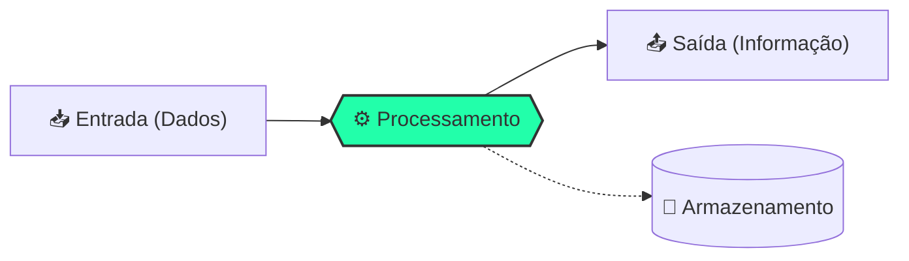

# 💻 Aula 01 – Introdução à Computação e Bases Numéricas

Bem-vindo à sua primeira lição! Vamos desvendar como a computação funciona e como transformamos impulsos elétricos em inteligência digital.

---

## 🎯 Objetivos de Aprendizagem

Ao final desta aula, você será capaz de:
- [x] Compreender o conceito fundamental de computação (Ciclo de Dados).
- [x] Diferenciar **Dado** de **Informação** com exemplos práticos.
- [x] Entender a necessidade biológica e técnica das bases numéricas.
- [x] Compreender o funcionamento do sistema posicional.

---

## 🧩 O que é Computação?

A computação é o **processamento automático da informação**. Todo computador, do smartphone ao supercomputador, opera baseado em um ciclo fundamental:



!!! info "Diferença Fundamental"
    === "Conceito"
        **Dado** é o elemento bruto, sem significado isolado (ex: "42"). **Informação** é o dado processado e contextualizado (ex: "42°C é a temperatura febril").
    === "Exemplo Prático"
        - **Dados**: Nomes e notas de alunos em uma planilha.
        - **Informação**: A média da turma e a lista de aprovados.

---

## ⚡ Como as máquinas "falam"?

Máquinas não entendem letras ou cores diretamente; elas entendem **níveis de tensão elétrica**.

- **Nível Alto (On)**: Dígito **1**.
- **Nível Baixo (Off)**: Dígito **0**.

Este é o **Sistema Binário**. A menor unidade de informação que um computador pode manipular é o **BIT** (*Binary Digit*).

=== "Representação Visual"
    <div class="termy">
    ```console
    $ bin-view --visualize
    Estado dos Pulsos:
    [█] [ ] [█] [█] [ ] [ ] [█] [ ]
     1   0   1   1   0   0   1   0
    ```
    </div>
=== "Hierarquia"
    - **1 Bit**: 0 ou 1.
    - **1 Byte**: Conjunto de 8 bits.
    - **1 KB**: ~1.000 Bytes.

---

## 🔢 Sistemas de Numeração

Para facilitar a comunicação entre humanos e máquinas, agrupamos os bits em diferentes bases:

| Sistema | Base | Dignidade | Uso Principal |
| :--- | :--- | :--- | :--- |
| **Decimal** | 10 | 0 a 9 | Vida cotidiana |
| **Binário** | 2 | 0 e 1 | Circuitos e Lógica |
| **Octal** | 8 | 0 a 7 | Permissões de Arquivos |
| **Hexadecimal** | 16 | 0-9 e A-F | Endereçamento e Cores |

---

## ⚙️ Notação Posicional

Em qualquer base tecnológica, o valor de um algarismo depende da sua posição.

!!! tip "A Fórmula da Posição"
    No sistema binário, usamos potências de 2:
    $$ 101_{2} = (1 \times 2^2) + (0 \times 2^1) + (1 \times 2^0) = 4 + 0 + 1 = 5_{10} $$

---

## 🚀 Desafio da Semana

Tente encontrar o **Endereço MAC** da placa de rede do seu computador (use o comando `ipconfig /all` no Windows ou `ifconfig` no Linux). 
- Ele usa letras? 
- Quantos grupos de caracteres ele possui?
- Identifique se ele está em Hexadecimal!

---

<div class="grid cards" markdown>

-   :material-presentation: **Slides Interativos**
    ---
    Revise os visuais e animações desta aula.
    [:octicons-arrow-right-24: Ver Slides](../slides/slide-01.html)

-   :material-school: **Quiz de Nivelamento**
    ---
    Teste o que você aprendeu com 10 questões.
    [:octicons-arrow-right-24: Responder Quiz](../quizzes/quiz-01.md)

-   :material-dumbbell: **Mão na Massa**
    ---
    5 exercícios do básico ao desafio master.
    [:octicons-arrow-right-24: Praticar](../exercicios/exercicio-01.md)

</div>

---
[:material-arrow-right: Próxima Aula: De Decimal para Binário](aula-02.md)
