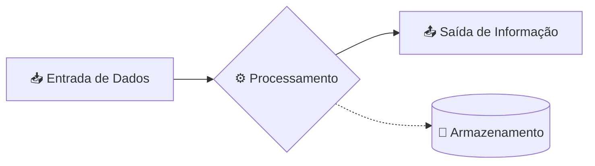

# 💻 Aula 01 – Introdução à Computação e Bases Numéricas

Bem-vindo à primeira aula do curso! Hoje vamos descobrir como os computadores "pensam" e por que eles usam uma linguagem tão diferente da nossa.

---

## 🎯 Objetivos de Aprendizagem

Ao final desta aula, você será capaz de:
-   [x] Compreender o conceito fundamental de computação.
-   [x] Diferenciar **Dado** de **Informação**.
-   [x] Entender por que usamos diferentes bases numéricas (Binário, Octal, Hexa).
-   [x] Compreender o funcionamento do sistema posicional.

---

## 🧩 O que é Computação?

A computação não é apenas sobre usar computadores; é sobre o **processamento automático da informação**. No nível mais básico, todo computador segue um ciclo simples:



!!! note "Dado vs Informação"
    **Dado** é o elemento bruto (ex: "42"). **Informação** é o dado com contexto (ex: "42°C é a temperatura febril"). A computação transforma dados brutos em inteligência útil.

---

## ⚡ Como as máquinas "falam"?

Humanos usam palavras e números de 0 a 9. Máquinas usam **eletricidade**.

-   **Nível Alto (On)**: Representado pelo dígito **1**.
-   **Nível Baixo (Off)**: Representado pelo dígito **0**.

Esse sistema de dois estados é o **Sistema Binário**. Cada dígito (0 ou 1) é chamado de **BIT** (*Binary Digit*).

<div class="termy">
```console
$ bin-view --visualize
Representação Interna:
[█] [ ] [█] [█] [ ] [ ] [█] [ ]
 1   0   1   1   0   0   1   0
```
</div>

---

## 🔢 Sistemas de Numeração

Dependendo do contexto, usamos diferentes "bases" para representar quantidades.

| Sistema | Base | Dígitos Disponíveis | Uso Comum |
| :--- | :--- | :--- | :--- |
| **Decimal** | 10 | 0, 1, 2, 3, 4, 5, 6, 7, 8, 9 | Cotidiano Humano |
| **Binário** | 2 | 0, 1 | Hardware e Lógica |
| **Octal** | 8 | 0, 1, 2, 3, 4, 5, 6, 7 | Permissões Unix |
| **Hexadecimal** | 16 | 0-9, A, B, C, D, E, F | Cores, Memória |

---

## ⚙️ Notação Posicional

Em qualquer base, o valor de um dígito depende da sua **posição**. No sistema decimal, usamos potências de 10:

$$ 157_{10} = (1 \times 10^2) + (5 \times 10^1) + (7 \times 10^0) $$

No sistema binário, usamos potências de 2:

$$ 101_{2} = (1 \times 2^2) + (0 \times 2^1) + (1 \times 2^0) = 4 + 0 + 1 = 5_{10} $$

---

## 🎨 Por que usar Hexadecimal?

Binários ficam muito longos rapidamente (ex: `111110101100`). O Hexadecimal agrupa **4 bits** em um único dígito, facilitando a leitura humana.

-   `1111` em binário vira `F` em Hexa.
-   `1010` em binário vira `A` em Hexa.

> [!TIP]
> Um Byte (8 bits) pode ser representado por apenas **2 dígitos hexadecimais** (ex: `FF` = 255).

---

## ✍️ Exercícios Rápidos

1. Qual a base preferida para representar cores na Web (ex: `#FF5733`)?
2. Quantos estados diferentes um **Bit** pode assumir?

---

## 🚀 Desafio da Semana
Tente encontrar em seu computador um "Endereço MAC" ou um "Endereço IPv6". Observe se eles utilizam letras e números e tente identificar a base numérica utilizada!

---

[:material-presentation: Ver Slides](lesson-01-slides){ .md-button }
[:material-school: Responder Quiz](quiz-01){ .md-button }
[:material-dumbbell: Praticar Exercícios](exercicio-01){ .md-button }

---
[Próxima Aula :material-arrow-right:](aula-02.md)
