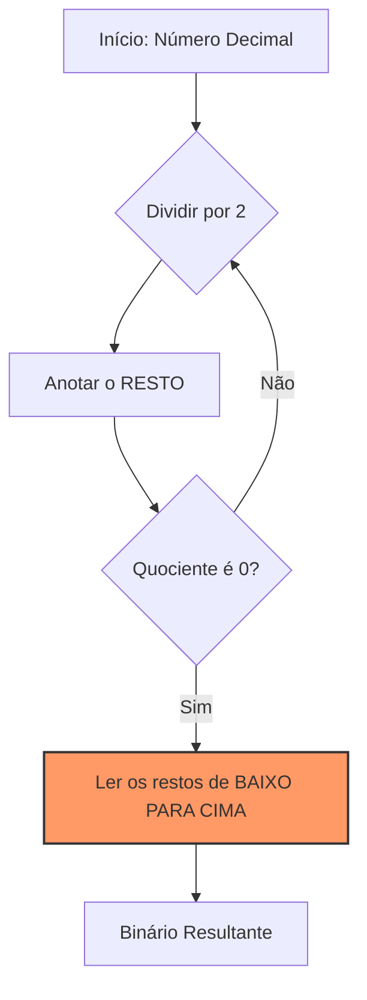

---
tags:
  - Bases-Numericas
  - Binario
  - Conversao
---

# ➗ Aula 02 – Conversão de Decimal para Binário

Na aula anterior, aprendemos que os computadores são máquinas binárias. Mas como pegamos um número que conhecemos (como nossa idade) e explicamos para o silício? Vamos aprender o "caminho de ida".

---

## 🎯 Objetivos de Aprendizagem

Nesta aula, você vai:
- [x] Aprender o método das **divisões sucessivas**.
- [x] Compreender o significado de **MSB** (*Most Significant Bit*) e **LSB** (*Least Significant Bit*).
- [x] Aplicar o método das **potências de 2** como alternativa rápida.

---

## 🧱 Método das Divisões Sucessivas

Este é o método mais seguro e universal. Ele consiste em dividir o número decimal por 2 repetidamente até que o quociente chegue a zero.



---

## 📝 Exemplo Prático: Convertendo 13

Vamos ver como o número **13** se transforma em código de máquina.

=== "Divisões Sucessivas"
    <div class="termy">
    ```console
    $ calc-convert 13 --to-binary
    1) 13 / 2 = 6  | Resto: 1  (LSB)
    2)  6 / 2 = 3  | Resto: 0
    3)  3 / 2 = 1  | Resto: 1
    4)  1 / 2 = 0  | Resto: 1  (MSB)

    🏁 Resultado (Baixo para Cima): 1101
    ```
    </div>
=== "Método das Potências"
    | 128 | 64 | 32 | 16 | **8** | **4** | 2 | **1** |
    |:---:|:---:|:---:|:---:|:---:|:---:|:---:|:---:|
    | 0 | 0 | 0 | 0 | **1** | **1** | 0 | **1** |

    - Somamos as potências onde há o bit **1**: $8 + 4 + 1 = 13$.

---

!!! info "Conceito Chave: MSB vs LSB"
    === "Definição"
        Nunca inverta a ordem! 
        - **LSB (Least Significant Bit)**: Primeiro resto (ponta direita).
        - **MSB (Most Significant Bit)**: Último resto (ponta esquerda).
    === "Dica de Leitura"
        A leitura do resultado deve ser feita sempre **de baixo para cima** (do último quociente para o primeiro resto anotado).

---

## 🚀 Desafio da Semana

Tente converter sua idade para binário. 
- O resultado é um número par ou ímpar?
- **Dica**: Se o primeiro resto (LSB) for 1, o número decimal original é obrigatoriamente ímpar!

---

<div class="grid cards" markdown>

-   :material-presentation: **Slides Interativos**
    ---
    Veja a animação do método das divisões passo a passo.
    [:octicons-arrow-right-24: Ver Slides](../slides/slide-02.html)

-   :material-school: **Quiz de Prática**
    ---
    Teste suas divisões com 10 questões rápidas.
    [:octicons-arrow-right-24: Responder Quiz](../quizzes/quiz-02.md)

-   :material-dumbbell: **Mão na Massa**
    ---
    Pratique conversões do básico ao avançado.
    [:octicons-arrow-right-24: Praticar](../exercicios/exercicio-02.md)

</div>

---
[« Aula Anterior](aula-01.md) | [Próxima Aula: Binário para Decimal :material-arrow-right:](aula-03.md)
