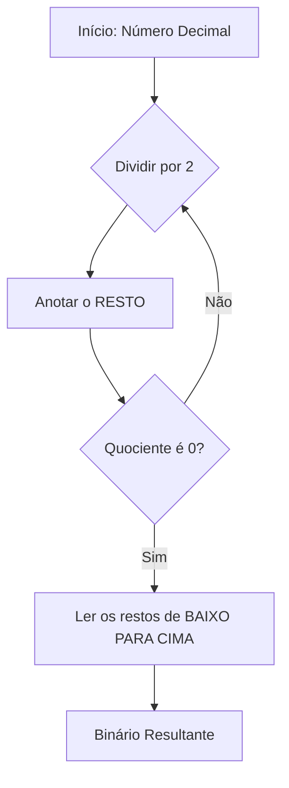

# ➗ Aula 02 – Conversão de Decimal para Binário

Na aula anterior, aprendemos que os computadores são máquinas binárias. Mas como pegamos um número que conhecemos (como nossa idade ou o preço de algo) e explicamos para o computador? Hoje vamos aprender o "caminho de ida": a conversão de **Decimal para Binário**.

---

## 🎯 Objetivos de Aprendizagem

Nesta aula, você vai:
-   [x] Aprender o método das **divisões sucessivas**.
-   [x] Compreender o significado de **MSB** (*Most Significant Bit*) e **LSB** (*Least Significant Bit*).
-   [x] Aplicar o método das potências de 2 como alternativa rápida.

---

## 🧱 Método das Divisões Sucessivas

Este é o método mais seguro e universal. Ele consiste em dividir o número decimal por 2 repetidamente até que o resultado chegue a zero.



---

## 📝 Exemplo Prático: Número 13

Vamos converter o número **13** para binário usando o método acima:

<div class="termy">
```console
$ calc-convert 13 --to-binary
1) 13 / 2 = 6  | Resto: 1  (LSB)
2)  6 / 2 = 3  | Resto: 0
3)  3 / 2 = 1  | Resto: 1
4)  1 / 2 = 0  | Resto: 1  (MSB)

Lendo de baixo para cima...
Resultado: 1101
```
</div>

---

## ⚠️ A Ordem Importa: MSB e LSB

Muitos estudantes erram a conversão por lerem os restos na ordem errada.

> [!IMPORTANT]
> -   **LSB (Least Significant Bit)**: É o primeiro resto obtido. Fica na extrema direita.
> -   **MSB (Most Significant Bit)**: É o último resto obtido. Fica na extrema esquerda.

**Regra de Ouro**: Sempre leia do último quociente para o primeiro resto (de baixo para cima).

---

## ⚡ Método 2: Subtração por Potências

Se você memorizar as potências de 2, pode converter números "de cabeça" muito mais rápido.

| $2^7$ | $2^6$ | $2^5$ | $2^4$ | $2^3$ | $2^2$ | $2^1$ | $2^0$ |
| :---: | :---: | :---: | :---: | :---: | :---: | :---: | :---: |
| 128 | 64 | 32 | 16 | 8 | 4 | 2 | 1 |

**Como funciona?**
Tente encaixar o número 13 nas potências:
-   Cabe 16? Não (0).
-   Cabe **8**? Sim (1). Sobram $13 - 8 = 5$.
-   Cabe **4**? Sim (1). Sobram $5 - 4 = 1$.
-   Cabe 2? Não (0).
-   Cabe **1**? Sim (1). Sobram 0.
-   Resultado: **1101**.

---

## ✍️ Exercícios Rápidos

1. Converta o número **25** para binário usando as divisões sucessivas.
2. Qual o binário do número **2**? (Dica: é mais simples do que parece!)

---

## 🚀 Desafio da Semana
Tente converter sua idade para binário. O resultado é um número par ou ímpar?
*Dica: Todo número ímpar termina em 1 em binário!*

---

[:material-presentation: Ver Slides](lesson-02-slides){ .md-button }
[:material-school: Responder Quiz](quiz-02){ .md-button }
[:material-dumbbell: Praticar Exercícios](exercicio-02){ .md-button }

---
[« Aula Anterior](aula-01.md) | [Próxima Aula »](aula-03.md)
