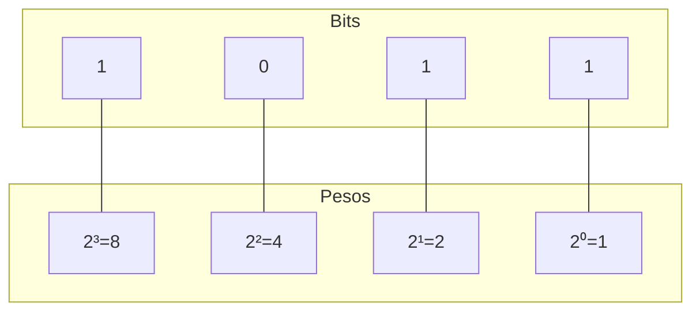

# 🔢 Aula 03 – Conversão Binário para Decimal

Agora que já sabemos como transformar nossos números decimais em binário, é hora de aprender o "caminho de volta". Como o computador nos mostra um resultado que possamos entender? Hoje vamos dominar a conversão de **Binário para Decimal**.

---

## 🎯 Objetivos de Aprendizagem

Nesta aula, você vai:
-   [x] Compreender o conceito de **valor posicional** no sistema binário.
-   [x] Aprender o método da **soma de pesos** (potências de 2).
-   [x] Praticar a conversão rápida de números binários pequenos e médios.

---

## 🏗️ O Conceito de Pesos

Assim como no sistema decimal (onde as casas valem 1, 10, 100, 1000...), no binário cada posição tem um "peso" que é uma potência de 2.



---

## 📝 Método da Soma de Pesos

Para converter, basta identificar onde estão os bits **1** e somar os seus pesos correspondentes.

<div class="termy">
```console
$ bin-convert 1101 --to-decimal
Análise de Bits:
1) Bit na pos 3: 1 x 2³ = 8
2) Bit na pos 2: 1 x 2² = 4
3) Bit na pos 1: 0 x 2¹ = 0
4) Bit na pos 0: 1 x 2⁰ = 1

Soma Final: 8 + 4 + 0 + 1
Resultado: 13
```
</div>

---

## 💡 Tabela de Apoio Rápido

Memorizar estas potências facilitará sua vida em todas as próximas aulas:

| Posição (n) | 7 | 6 | 5 | 4 | 3 | 2 | 1 | 0 |
| :--- | :---: | :---: | :---: | :---: | :---: | :---: | :---: | :---: |
| **Peso ($2^n$)** | **128** | **64** | **32** | **16** | **8** | **4** | **2** | **1** |

> [!TIP]
> Notou que cada peso é exatamente o dobro do peso à sua direita? Isso torna a escala muito fácil de lembrar!

---

## ⚖️ Exemplo: Convertendo um Byte

Vamos converter o byte `10101010`:
-   $1 \times 128 = 128$
-   $0 \times 64 = 0$
-   $1 \times 32 = 32$
-   $0 \times 16 = 0$
-   $1 \times 8 = 8$
-   $0 \times 4 = 0$
-   $1 \times 2 = 2$
-   $0 \times 1 = 0$
-   **Soma**: $128 + 32 + 8 + 2 = 170$

---

## ✍️ Exercícios Rápidos

1. Converta o binário `111` para decimal. (Dica: some os pesos das posições 2, 1 e 0).
2. Qual o valor decimal do binário `10000`?

---

## 🚀 Desafio da Semana
Qual o maior número decimal que você consegue representar usando apenas 4 bits (ex: `1111`)? E com 8 bits? Tente descobrir a relação entre o número de bits e o valor máximo suportado!

---

[:material-presentation: Ver Slides](lesson-03-slides){ .md-button }
[:material-school: Responder Quiz](quiz-03){ .md-button }
[:material-dumbbell: Praticar Exercícios](exercicio-03){ .md-button }

---
[« Aula Anterior](aula-02.md) | [Próxima Aula »](aula-04.md)
