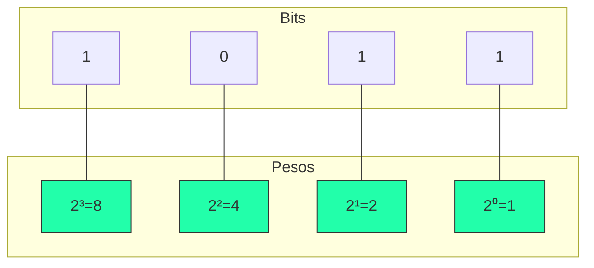

---
tags:
  - Bases-Numericas
  - Binario
  - Conversao
---

# 🔢 Aula 03 – Conversão Binário para Decimal

Agora que já sabemos como transformar nossos números decimais em binário, é hora de aprender o "caminho de volta". Como o computador nos mostra um resultado que possamos entender? 

---

## 🎯 Objetivos de Aprendizagem

Nesta aula, você vai:
- [x] Compreender o conceito de **valor posicional** no sistema binário.
- [x] Aprender o método da **soma de pesos** (potências de 2).
- [x] Praticar a conversão rápida de números binários pequenos e médios.

---

## 🏗️ O Conceito de Pesos

Assim como no sistema decimal (onde as casas valem 1, 10, 100, 1000...), no binário cada posição tem um "peso" que é uma potência de 2.



---

## 📝 Método da Soma de Pesos

Para converter, basta identificar onde estão os bits **1** e somar os seus pesos correspondentes.

=== "Exemplo: 1101"
    <div class="termy" markdown>

    ```console
    $ bin-convert 1101 --to-decimal
    Análise de Pesos:
    (1 x 8) + (1 x 4) + (0 x 2) + (1 x 1)
    
    🏁 Soma: 8 + 4 + 0 + 1 = 13
    ```

    </div>
=== "Exemplo: 10101010"
    - $1 \times 128 = 128$
    - $1 \times 32 = 32$
    - $1 \times 8 = 8$
    - $1 \times 2 = 2$
    - **Soma Total**: 170

---

!!! tip "Dica de Memorização"
    === "Escala de Dobros"
        Notou que cada peso é exatamente o **dobro** do peso à sua direita? 
        $1 \to 2 \to 4 \to 8 \to 16 \to 32 \to 64 \to 128 \dots$
    === "Por que funciona?"
        Como a base é 2, cada deslocamento para a esquerda representa elevar a potência de 2 em 1 ($2^n$), multiplicando o valor anterior por 2.

---

## 🚀 Desafio da Semana

Qual o maior número decimal que você consegue representar usando apenas **4 bits** (ex: `1111`)? 
- E com **8 bits**? 
- **Pista**: Tente somar todos os pesos da tabela acima e veja o que acontece!

---

<div class="grid cards" markdown>

-   :material-presentation: **Slides Interativos**
    ---
    Visualize a soma dos pesos com animações dinâmicas.
    [:octicons-arrow-right-24: Ver Slides](../slides/slide-03.html)

-   :material-school: **Quiz de Prática**
    ---
    10 questões para testar sua agilidade mental.
    [:octicons-arrow-right-24: Responder Quiz](../quizzes/quiz-03.md)

-   :material-dumbbell: **Mão na Massa**
    ---
    Exercícios de conversão binária para consolidar.
    [:octicons-arrow-right-24: Praticar](../exercicios/exercicio-03.md)

</div>

---
[« Aula Anterior](aula-02.md) | [Próxima Aula: Sistema Octal :material-arrow-right:](aula-04.md)
