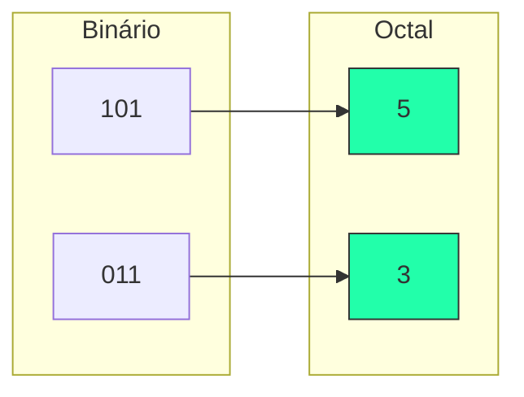

---
tags:
  - Bases-Numericas
  - Octal
  - Conversao
---

# 🎱 Aula 04 – Sistema Octal (Base 8)

Você já se perguntou por que os comandos de segurança no Linux usam números como `755` ou `644`? Isso acontece porque esses sistemas utilizam o **Sistema Octal**. Vamos aprender como essa base funciona e qual sua relação direta com o mundo binário.

---

## 🎯 Objetivos de Aprendizagem

Nesta aula, você vai:
- [x] Conhecer a base 8 e seus dígitos (0 a 7).
- [x] Entender a relação matemática entre a Base 2 e a Base 8 ($2^3 = 8$).
- [x] Aprender a converter entre Binário e Octal através do agrupamento de bits.
- [x] Ver uma aplicação real: permissões de arquivos em sistemas Unix/Linux.

---

## 🏗️ O que é o Sistema Octal?

O sistema octal utiliza a **Base 8**, possuindo apenas 8 símbolos disponíveis: **0, 1, 2, 3, 4, 5, 6, 7**.

!!! warning "Dígitos Proibidos"
    Os dígitos **8** e **9** não existem no sistema octal! Se você encontrar o número $18_{8}$, saiba que ele é um valor **inválido**.

---

## 🤝 A Relação Mágica: 3 Bits = 1 Dígito Octal

A grande vantagem do octal é que podemos converter binários longos apenas agrupando os bits de **três em três** (da direita para a esquerda).

---

## 📝 Prática de Conversão

=== "Binário para Octal"
    Para converter `11010111`:
    1. Separe em trios: `11 | 010 | 111`
    2. Complete o trio da esquerda: `011 | 010 | 111`
    3. Use a tabela 4-2-1:
        - `011 = 3`
        - `010 = 2`
        - `111 = 7`
    
    🏁 **Resultado: 327₈**
=== "Permissões Linux"
    No Linux, somamos permissões para gerar um dígito octal:
    - **7** (4+2+1): Tudo (Ler, Gravar, Executar).
    - **5** (4+0+1): Apenas Ler e Executar.
    - **4** (4+0+0): Somente Leitura.

    !!! tip "Dica de SysAdmin"
        O comando `chmod 755 arquivo` é o padrão para scripts que todos podem ler e rodar, mas só você pode alterar. O primeiro dígito (7) refere-se ao dono (você!).

---

## 🚀 Desafio da Semana

Descubra como representar o número decimal **10** na base octal. 
- Lembre-se: o próximo número após o 7 em octal não é o 8, mas o **10₈**!

---

-   :material-presentation: **Slides Interativos**
    ---
    Visualize o agrupamento de bits e as permissões de arquivos.
    [:octicons-arrow-right-24: Ver Slides](../slides/slide-04.html)

-   :material-school: **Quiz de Prática**
    ---
    10 desafios sobre base 8 e comandos Linux.
    [:octicons-arrow-right-24: Responder Quiz](../quizzes/quiz-04.md)

-   :material-dumbbell: **Mão na Massa**
    ---
    Exercícios de conversão octal e binária.
    [:octicons-arrow-right-24: Praticar](../exercicios/exercicio-04.md)

---
[« Aula Anterior](aula-03.md) | [Módulo 2: Hexadecimal e Aritmética :material-arrow-right:](aula-05.md)
