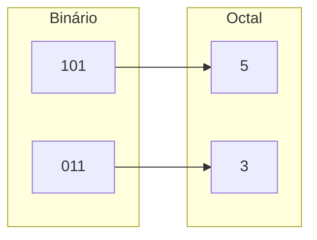

# 🎱 Aula 04 – Sistema Octal (Base 8)

Você já se perguntou por que os comandos de segurança no Linux usam números como `755` ou `644`? Isso acontece porque esses sistemas utilizam o **Sistema Octal**. Hoje vamos aprender como essa base funciona e qual sua relação direta com o mundo binário.

---

## 🎯 Objetivos de Aprendizagem

Nesta aula, você vai:
-   [x] Conhecer a base 8 e seus dígitos (0 a 7).
-   [x] Entender a relação matemática entre a Base 2 e a Base 8 ($2^3 = 8$).
-   [x] Aprender a converter entre Binário e Octal através do agrupamento de bits.
-   [x] Ver uma aplicação real: permissões de arquivos em sistemas Unix/Linux.

---

## 🏗️ O que é o Sistema Octal?

O sistema octal utiliza a **Base 8**, o que significa que ele possui apenas 8 símbolos disponíveis:
**0, 1, 2, 3, 4, 5, 6, 7**

> [!WARNING]
> Os dígitos **8** e **9** não existem no sistema octal! Se você vir o número $18_{8}$, saiba que ele é inválido.

---

## 🤝 A Relação Mágica: 3 Bits = 1 Dígito Octal

A grande vantagem do octal é que podemos converter binários longos para octal apenas "olhando" e agrupando os bits de **três em três** (da direita para a esquerda).



---

## 📝 Exemplo Prático: Binário para Octal

Vamos converter o binário `11010111`:

<div class="termy">
```console
$ bin-to-octal 11010111
1. Separe em trios (da direita para a esquerda):
   11 | 010 | 111

2. Complete o trio da esquerda com zero, se necessário:
   011 | 010 | 111

3. Converta cada trio usando a tabela de pesos (4-2-1):
   011 = 3
   010 = 2
   111 = 7

Resultado: 327
```
</div>

---

## 💡 Aplicação Real: Permissões Linux

No Linux, cada arquivo tem permissões de **Leitura (4)**, **Escrita (2)** e **Execução (1)**. A soma dessas permissões resulta em um dígito octal:

-   **7** (4+2+1): Permissão total (Ler, Escrever, Executar).
-   **5** (4+0+1): Ler e Executar apenas.
-   **4** (4+0+0): Apenas Leitura.

!!! example "Comando chmod"
    O famoso comando `chmod 755 arquivo` define que o dono pode tudo (7), e os outros podem apenas ler e executar (5).

---

## ✍️ Exercícios Rápidos

1. Qual o equivalente octal do binário `111`?
2. Converta o número octal `25` para binário. (Dica: transforme cada dígito em um trio de 3 bits).

---

## 🚀 Desafio da Semana
Descubra como representar o número decimal **10** na base octal. Lembre-se: você não pode usar os dígitos 8 ou 9!

---

[:material-presentation: Ver Slides](lesson-04-slides){ .md-button }
[:material-school: Responder Quiz](quiz-04){ .md-button }
[:material-dumbbell: Praticar Exercícios](exercicio-04){ .md-button }

---
[« Aula Anterior](aula-03.md) | [Próxima Aula »](aula-05.md)
