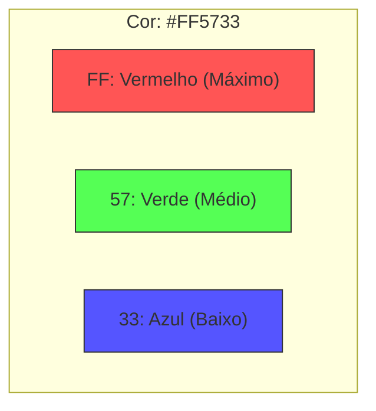

---
tags:
  - Bases-Numericas
  - Hexadecimal
  - Conversao
---

# 🔢 Aula 05 – Sistema Hexadecimal (Base 16)

Se existe uma base numérica que todo desenvolvedor, designer e engenheiro de hardware precisa dominar, é o **Hexadecimal**. De cores no CSS até endereços de memória, o Hexa está em todo lugar. Vamos entender por que ele é tão amado pela tecnologia.

---

## 🎯 Objetivos de Aprendizagem

Nesta aula, você vai:
- [x] Conhecer a base 16 e seus 16 símbolos (0-9 e A-F).
- [x] Entender a relação entre a Base 2 e a Base 16 ($2^4 = 16$).
- [x] Aprender a converter Decimal para Hexadecimal através de divisões.
- [x] Ver aplicações reais: cores RGB e endereços de memória.

---

## 🏗️ Os 16 Símbolos do Hexa

Como não temos algarismos únicos para os valores de 10 a 15, o sistema hexadecimal utiliza as primeiras letras do alfabeto:

| Decimal | 0-9 | 10 | 11 | 12 | 13 | 14 | 15 |
| :--- | :---: | :---: | :---: | :---: | :---: | :---: | :---: |
| **Hexa** | **0-9** | **A** | **B** | **C** | **D** | **E** | **F** |

!!! info "Pense em Equivalência"
    Pense no **A** como o "dez", no **B** como o "onze", e assim por diante até o **F**, que é o "quinze". É apenas uma forma de economizar espaço!

---

## 🎨 Aplicação Real: Cores Web (RGB)

As cores na sua tela são misturas de Vermelho (**R**ed), Verde (**G**reen) e Azul (**B**lue). Cada canal vai de 0 a 255 (que em hexa é **FF**).



---

## 📝 Prática de Conversão

Para converter decimal para hexa, dividimos por **16**.

=== "Cálculo Passo a Passo"
    <div class="termy" markdown>

    ```console
    $ calc-convert 250 --to-hex
    1) 250 / 16 = 15 | Resto: 10 -> [A]
    2)  15 / 16 = 0  | Resto: 15 -> [F]

    🏁 Resultado (Baixo para Cima): FA
    ```

    </div>
=== "A Regra do Quarteto"
    A razão do sucesso do Hexa é que **1 dígito hexa** representa exatamente **4 bits** (1 nibble).
    - `1111 1111` (binário) = `FF` (hexa).
    - 2 dígitos hexa = **1 Byte** (8 bits).

---

## 🚀 Desafio da Semana

Abra o "Inspetor de Elementos" (F12) em qualquer site, escolha uma cor e identifique:
- Quanto de Vermelho ela tem em Hexa?
- O que acontece se você mudar tudo para `00`?

---

<div class="grid cards" markdown>

-   :material-presentation: **Slides Interativos**
    ---
    Veja como as letras A-F facilitam a leitura de memória.
    [:octicons-arrow-right-24: Ver Slides](../slides/slide-05.html)

-   :material-school: **Quiz de Prática**
    ---
    Teste sua memória sobre a tabela A-F e conversões.
    [:octicons-arrow-right-24: Responder Quiz](../quizzes/quiz-05.md)

-   :material-dumbbell: **Mão na Massa**
    ---
    Exercícios de conversão e cálculo de cores Hexa.
    [:octicons-arrow-right-24: Praticar](../exercicios/exercicio-05.md)

</div>

---
[« Aula Anterior](aula-04.md) | [Próxima Aula: Binário para Hexadecimal :material-arrow-right:](aula-06.md)
