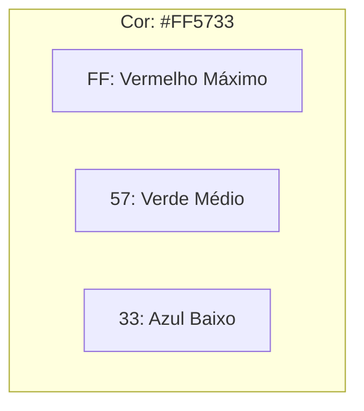

# 🔢 Aula 05 – Sistema Hexadecimal (Base 16)

Se existe uma base numérica que todo desenvolvedor, designer e engenheiro de hardware precisa dominar, é o **Hexadecimal**. De cores no CSS até endereços de memória e chaves de segurança, o Hexa está em todo lugar. Hoje vamos entender o porquê.

---

## 🎯 Objetivos de Aprendizagem

Nesta aula, você vai:
-   [x] Conhecer a base 16 e seus 16 símbolos (0-9 e A-F).
-   [x] Entender a relação entre a Base 2 e a Base 16 ($2^4 = 16$).
-   [x] Aprender a converter Decimal para Hexadecimal através de divisões.
-   [x] Ver aplicações reais: cores RGB e endereços de memória.

---

## 🏗️ Os 16 Símbolos do Hexa

Como não temos algarismos únicos para os valores 10, 11, 12, 13, 14 e 15, o sistema hexadecimal utiliza as primeiras letras do alfabeto:

| Decimal | 0-9 | 10 | 11 | 12 | 13 | 14 | 15 |
| :--- | :---: | :---: | :---: | :---: | :---: | :---: | :---: |
| **Hexa** | **0-9** | **A** | **B** | **C** | **D** | **E** | **F** |

> [!NOTE]
> Pense no **A** como o "dez", no **B** como o "onze", e assim por diante até o **F**, que é o "quinze".

---

## 🎨 Aplicação Real: Cores Web (RGB)

As cores na tela do seu computador são formadas pela mistura de Vermelho (Red), Verde (Green) e Azul (Blue). Cada canal pode variar de 0 a 255 ($FF$ em hexa).



Quando você vê `#FFFFFF`, significa que os três canais estão no máximo (Branco). Se vir `#000000`, todos estão no mínimo (Preto).

---

## ➗ Convertendo Decimal para Hexa

Assim como convertemos para binário dividindo por 2, para hexadecimal dividimos por **16**.

<div class="termy">
```console
$ calc-convert 250 --to-hex
1) 250 / 16 = 15 | Resto: 10 (A)
2)  15 / 16 = 0  | Resto: 15 (F)

Lendo de baixo para cima...
Resultado: FA
```
</div>

---

## ⚡ A Regra do Quarteto (Nibble)

A razão do sucesso do Hexa é que **1 dígito hexa** representa exatamente **4 bits** (chamado de *Nibble*). Isso significa que 2 dígitos hexa representam perfeitamente **1 Byte** (8 bits).

-   `1111 1111` binário = `FF` em hexa.
-   Muito mais fácil de ler e digitar, certo?

---

## ✍️ Exercícios Rápidos

1. Qual o valor decimal da letra **C** no sistema hexadecimal?
2. Represente o número decimal **16** em hexadecimal. (Dica: divida 16 por 16).

---

## 🚀 Desafio da Semana
Abra uma ferramenta de inspeção no seu navegador (F12), escolha uma cor de qualquer site e tente identificar seus componentes Vermelho, Verde e Azul em Hexadecimal!

---

[:material-presentation: Ver Slides](lesson-05-slides){ .md-button }
[:material-school: Responder Quiz](quiz-05){ .md-button }
[:material-dumbbell: Praticar Exercícios](exercicio-05){ .md-button }

---
[« Aula Anterior](aula-04.md) | [Próxima Aula »](aula-06.md)
