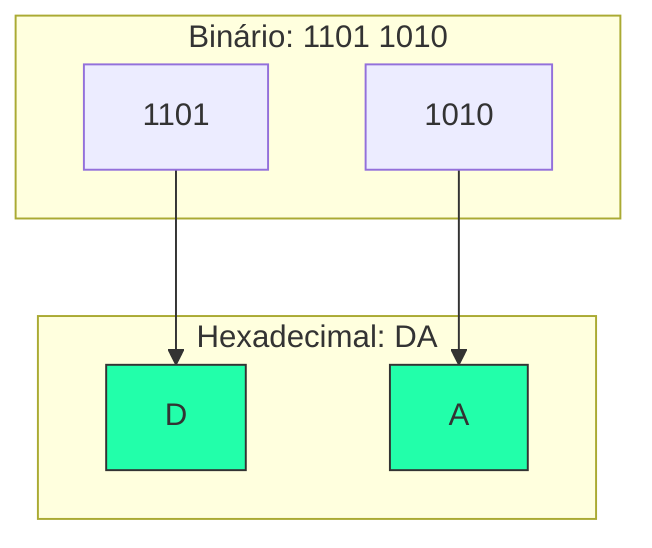

---
tags:
  - Bases-Numericas
  - Hexadecimal
  - Binario
---

# 🚀 Aula 06 – Conversão Binário Hexadecimal

Você já notou que o endereço físico (MAC) da sua placa de rede ou um endereço IPv6 parece uma "sopa de letrinhas e números"? Na verdade, eles são apenas números binários muito longos resumidos para facilitar a nossa vida. Hoje vamos aprender o **atalho definitivo**.

---

## 🎯 Objetivos de Aprendizagem

Nesta aula, você vai:
- [x] Masterizar a técnica de agrupamento de 4 bits (**Nibbles**).
- [x] Aprender a converter binários longos para hexa sem passar pelo decimal.
- [x] Aprender o caminho inverso: transformar hexa em 4 bits instantaneamente.
- [x] Entender a aplicação em endereços de hardware e redes.

---

## 🏗️ O Atalho do Quarteto (Nibble)

A base 16 ($2^4$) tem uma relação perfeita com a base 2. Cada **um** dígito hexadecimal representa exatamente **quatro** bits em binário.

---

## 📝 Prática de Conversão

=== "Binário para Hexa"
    Para converter `1011110010`:
    1. Agrupe de 4 em 4 (da direita): `10 | 1111 | 0010`
    2. Complete com zeros: `0010 | 1111 | 0010`
    3. Traduza cada bloco:
        - `0010 = 2`
        - `1111 = F`
        - `0010 = 2`
    
    🏁 **Resultado: 2F2₁₆**
=== "Hexa para Binário"
    Basta "explodir" cada dígito em 4 bits.
    
    !!! warning "Cuidado: O Zero é Obrigatório"
        === "O Erro Comum"
            Muitos alunos esquecem de representar o zero com 4 bits, o que corrompe o número final.
        === "Forma Correta"
            Ao converter `A0B`, o zero do meio **deve** ter 4 bits (`0000`):
            - A = `1010`
            - **0 = `0000`**
            - B = `1011`
            
            🏁 **Resultado: 101000001011**

---

## 🚀 Desafio da Semana

Descubra o **Endereço MAC** da sua placa de rede (use `ipconfig /all` no Windows). 
- Ele tem quantos dígitos hexadecimais? 
- Tente converter os primeiros dois dígitos para binário manualmentte!

---

-   :material-presentation: **Slides Interativos**
    ---
    Veja a expansão e compressão de bits em tempo real.
    [:octicons-arrow-right-24: Ver Slides](../slides/slide-06.html)

-   :material-school: **Quiz de Prática**
    ---
    10 desafios sobre o atalho definitivo do Nibble.
    [:octicons-arrow-right-24: Responder Quiz](../quizzes/quiz-06.md)

-   :material-dumbbell: **Mão na Massa**
    ---
    Converta endereços de rede e cores complexas.
    [:octicons-arrow-right-24: Praticar](../exercicios/exercicio-06.md)

---
[« Aula Anterior](aula-05.md) | [Próxima Aula: Aritmética Binária :material-arrow-right:](aula-07.md)
