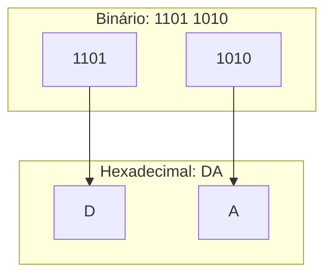

# 🚀 Aula 06 – Conversão Binário Hexadecimal

Você já notou que o endereço físico (MAC) da sua placa de rede ou um endereço IPv6 parece uma "sopa de letrinhas e números"? Na verdade, eles são apenas números binários muito longos que foram resumidos para facilitar a nossa vida. Hoje vamos aprender o **atalho definitivo**: a conversão direta de **Binário para Hexadecimal**.

---

## 🎯 Objetivos de Aprendizagem

Nesta aula, você vai:
-   [x] Masterizar a técnica de agrupamento de 4 bits (**Nibbles**).
-   [x] Aprender a converter binários longos para hexa sem passar pelo decimal.
-   [x] Aprender o caminho inverso: transformar um dígito hexa em 4 bits instantaneamente.
-   [x] Entender a aplicação em endereços de hardware e redes.

---

## 🏗️ O Atalho do Quarteto (Nibble)

A base 16 ($2^4$) tem uma relação perfeita com a base 2. Cada **um** dígito hexadecimal representa exatamente **quatro** bits em binário.



---

## 📝 Exemplo Prático: Binário para Hexa

Vamos converter o binário `1011110010`:

<div class="termy">
```console
$ bin-to-hexa 1011110010
1. Agrupe de 4 em 4 (da direita para a esquerda):
   10 | 1111 | 0010

2. Complete com zeros à esquerda:
   0010 | 1111 | 0010

3. Traduza cada bloco de 4 bits:
   0010 = 2
   1111 = F
   0010 = 2

Resultado: 2F2
```
</div>

---

## 🔄 Hexa para Binário: Expansão Total

Para fazer o caminho de volta, basta "explodir" cada dígito hexa em 4 bits. **Cuidado**: nunca use menos que 4 bits para representar um dígito do meio!

!!! warning "O erro do zero"
    Se você converter `A0B` e esquecer os zeros do meio, o número estará errado.
    -   A = `1010`
    -   0 = `0000` (Obrigatório!)
    -   B = `1011`
    -   Resultado: `1010 0000 1011`

---

## 💡 Aplicação Real: Endereços IPv6

O novo padrão de endereços da internet (IPv6) usa 128 bits. Imagine decorar 128 zeros e uns! Por isso, usamos o Hexa:

`2001:0db8:85a3:0000:0000:8a2e:0370:7334`

Cada caractere que você vê ali resume 4 bits de informação.

---

## ✍️ Exercícios Rápidos

1. Qual o equivalente hexadecimal do binário `1100 1100`?
2. Transforme o hexa `7E` em binário.

---

## 🚀 Desafio da Semana
Descubra o endereço MAC da sua placa de rede (usando o comando `ipconfig /all` no Windows ou `ifconfig` no Linux). Tente converter os primeiros dois dígitos para binário!

---

[:material-presentation: Ver Slides](lesson-06-slides){ .md-button }
[:material-school: Responder Quiz](quiz-06){ .md-button }
[:material-dumbbell: Praticar Exercícios](exercicio-06){ .md-button }

---
[« Aula Anterior](aula-05.md) | [Próxima Aula »](aula-07.md)
