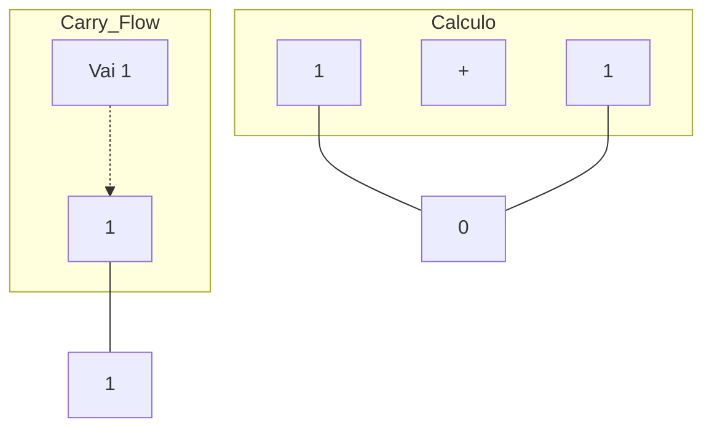

# 🧮 Aula 07 – Aritmética Binária

Como o computador consegue somar números se ele só entende 0 e 1? A resposta é simples: ele segue as mesmas regras que nós, mas com uma base muito menor. Hoje vamos aprender as 4 regras fundamentais da **Soma Binária** e entender como lidar com o famoso "vai-um".

---

## 🎯 Objetivos de Aprendizagem

Nesta aula, você vai:
-   [x] Aprender as 4 regras básicas da soma binária.
-   [x] Dominar o conceito de **Carry Out** (Vai-um) em cálculos complexos.
-   [x] Compreender a lógica da subtração binária e do **Borrow** (empréstimo).
-   [x] Identificar e entender o que é um **Overflow** (Transbordamento).

---

## ➕ Regras da Soma Binária

A soma binária é quase igual à decimal, mas você "fecha uma dezena" (vai-um) muito mais rápido:

| Operação | Resultado | Comentário |
| :---: | :---: | :--- |
| **0 + 0** | **0** | Normal |
| **0 + 1** | **1** | Normal |
| **1 + 0** | **1** | Normal |
| **1 + 1** | **0** | **Vai 1** para a próxima coluna! |

---

## 🚀 O Conceito de Carry (Vai-Um)

Quando somamos $1+1$, o resultado é $10_{2}$ (que vale 2 em decimal). O `0` fica na coluna atual e o `1` sobe para a próxima casa à esquerda.



---

## 📝 Exemplo Interativo: Soma Complexa

Vamos somar `1011` (11) com `0111` (7):

<div class="termy">
```console
$ bin-math sum 1011 0111
   [1][1][1]  <-- Carries (vai-um)
     1 0 1 1  (11)
   + 0 1 1 1  (7)
   ---------
   1 0 0 1 0  (18)

Verificação: 18 em binário é 10010. Correto!
```
</div>

---

## 🌊 O Perigo do Overflow

O que acontece quando o resultado de uma soma é maior do que o número de bits que o computador consegue guardar?

> [!WARNING]
> Se um sistema de 8 bits (máximo 255) tentar somar $200 + 100$, o resultado será 300. Como 300 não cabe em 8 bits, o computador "perde" o bit mais significativo e mostra um valor errado (44). Isso se chama **Overflow**.

---

## ➖ Subtração Binária (Borrow)

Na subtração, quando tentamos tirar 1 de 0, precisamos "pedir emprestado" (Borrow) da casa à esquerda. Esse empréstimo em binário vale **2**.

-   `0 - 1` = **1** (e pede 1 emprestado à esquerda).

---

## ✍️ Exercícios Rápidos

1. Quanto é `11` + `11` em binário?
2. Se somarmos `101` (5) com `010` (2), qual o resultado final?

---

## 🚀 Desafio da Semana
Tente somar `1111` + `0001`. Observe como o "vai-um" viaja por todas as colunas até o final. Esse efeito é chamado de *Ripple Carry*.

---

[:material-presentation: Ver Slides](lesson-07-slides){ .md-button }
[:material-school: Responder Quiz](quiz-07){ .md-button }
[:material-dumbbell: Praticar Exercícios](exercicio-07){ .md-button }

---
[« Aula Anterior](aula-06.md) | [Próxima Aula »](aula-08.md)
