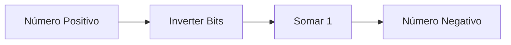

# 📦 Aula 08 – Representação de Dados

Até agora, vimos como o computador lida com números positivos. Mas como ele sabe se um número é negativo? E como ele guarda textos, emojis e símbolos? Hoje vamos mergulhar na **Representação de Dados** e descobrir o padrão que domina o mundo digital: o **Complemento de 2** e o **UTF-8**.

---

## 🎯 Objetivos de Aprendizagem

Nesta aula, você vai:
-   [x] Aprender a representar números negativos usando **Complemento de 2**.
-   [x] Entender a diferença entre as codificações **ASCII** e **UTF-8**.
-   [x] Compreender como os caracteres são mapeados para números binários.
-   [x] Descobrir como um único arquivo pode conter diversos tipos de dados.

---

## ➖ Números Negativos: Complemento de 2

O computador não usa o símbolo `-`. Em vez disso, ele usa um truque matemático inteligente onde o bit mais à esquerda (MSB) indica o sinal (0 para +, 1 para -).



**Exemplo: Representando -5 (em 8 bits)**
1.  **+5** em binário: `0000 0101`
2.  **Inverta** tudo: `1111 1010`
3.  **Some 1**: `1111 1011`
4.  Resultado: `1111 1011` representa o **-5**.

---

## 🔤 Codificação de Texto

Para o computador, a letra "A" não existe; o que existe é o número **65**. Esse mapeamento é feito por tabelas de codificação.

| Padrão | Bits | Características |
| :--- | :---: | :--- |
| **ASCII** | 7/8 | Básico, apenas caracteres da língua inglesa. |
| **UNICODE** | variável | Suporta todos os idiomas do mundo + Emojis. |
| **UTF-8** | 8-32 | O formato mais usado na web, compatível com ASCII. |

> [!TIP]
> O **UTF-8** é tão eficiente porque usa apenas 1 byte para letras comuns (A, B, C) e aumenta para até 4 bytes apenas quando precisa representar símbolos complexos ou emojis 🚀.

---

## 🔍 Visualizando os Bytes

Como o computador "vê" a palavra `Ads`?

<div class="termy">
```console
$ hex-dump "Ads"
Texto:   A      d      s
Decimal: 65     100    115
Hexa:    41     64     73
Binário: 01000001 01100100 01110011
```
</div>

---

## ✍️ Exercícios Rápidos

1. Qual a vantagem do Complemento de 2 em relação ao método de apenas mudar o bit de sinal? (Dica: pense na operação de soma).
2. Se a letra 'A' é o número 65 em ASCII, qual o número da letra 'C'?

---

## 🚀 Desafio da Semana
Pesquise o que é um "BOM" (*Byte Order Mark*) em arquivos de texto e por que ele é importante para o Windows saber se um arquivo é UTF-8 ou não.

---

[:material-presentation: Ver Slides](lesson-08-slides){ .md-button }
[:material-school: Responder Quiz](quiz-08){ .md-button }
[:material-dumbbell: Praticar Exercícios](exercicio-08){ .md-button }

---
[« Aula Anterior](aula-07.md) | [Próxima Aula »](aula-09.md)
