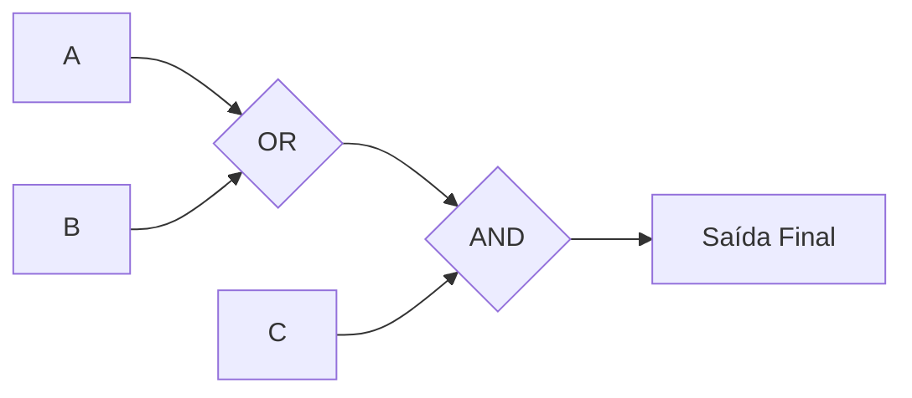

# 🧠 Aula 09 – Lógica Booleana

Até agora, tratamos os bits (0 e 1) como números. Mas o poder real do computador surge quando tratamos esses bits como **Valores Lógicos**: Falso (0) ou Verdadeiro (1). Hoje vamos aprender como a **Lógica Booleana** permite que o computador tome decisões, valide senhas e controle máquinas complexas.

---

## 🎯 Objetivos de Aprendizagem

Nesta aula, você vai:
-   [x] Compreender os valores lógicos: Verdadeiro (1) e Falso (0).
-   [x] Conhecer e aplicar os operadores fundamentais: **NOT**, **AND** e **OR**.
-   [x] Aprender a ler e construir Tabelas Verdade básicas.
-   [x] Entender a prioridade das operações lógicas.

---

## ⚙️ Os Três Pilares da Lógica

Para combinar estados e tomar decisões, usamos três operadores básicos:

### 1. NOT (NÃO) - O Inversor
Inverte qualquer estado. Se entra 1, sai 0. Se entra 0, sai 1.

| Entrada (A) | Saída (¬A) |
| :---: | :---: |
| 0 | 1 |
| 1 | 0 |

---

### 2. AND (E) - A Conjunção
A saída só é verdadeira se **AMBAS** as entradas forem verdadeiras. Pense em um login: você precisa do usuário CORRETO **E** da senha CORRETA.

| A | B | Saída (A ∧ B) |
| :---: | :---: | :---: |
| 0 | 0 | 0 |
| 0 | 1 | 0 |
| 1 | 0 | 0 |
| 1 | 1 | 1 |

---

### 3. OR (OU) - A Disjunção
A saída é verdadeira se **AO MENOS UMA** das entradas for verdadeira. Pense em um alarme: ele toca se a porta for aberta **OU** se a janela for aberta.

| A | B | Saída (A ∨ B) |
| :---: | :---: | :---: |
| 0 | 0 | 0 |
| 0 | 1 | 1 |
| 1 | 0 | 1 |
| 1 | 1 | 1 |

---

## 📊 Fluxo de Decisão

Veja como uma expressão como `(A OR B) AND C` pode ser visualizada:



---

## 🔍 Exemplo Prático: Sensor de Incêndio

Imagine um sistema que ativa o extintor se:
(Detectar Fumaça **AND** Temperatura > 50°C) **OU** Botão de Emergência for apertado.

<div class="termy">
```console
$ check-security --fire-sensor
Entradas:
- Fumaça (A): 1 (Detectada)
- Temperatura (B): 0 (40°C - Normal)
- Botão (C): 1 (Apertado!)

Cálculo: (A AND B) OR C -> (1 AND 0) OR 1 -> 0 OR 1
Resultado: 1 (EXTINTOR ATIVADO)
```
</div>

---

## 🧐 Ordem de Precedência

Assim como na matemática (onde a multiplicação vem antes da soma), na lógica booleana existe uma ordem:

> [!WARNING]
> 1. **NOT** (Inversão)
> 2. **AND** (Conjunção)
> 3. **OR** (Disjunção)
> *Dica: Sempre use parênteses para garantir que o cálculo seja feito na ordem que você deseja!*

---

## ✍️ Exercícios Rápidos

1. Qual o resultado de `1 AND (0 OR 1)`?
2. Se `A = 1`, qual o valor de `NOT (NOT A)`?

---

## 🚀 Desafio da Semana
Tente encontrar um exemplo de lógica "OU" no seu dia a dia (ex: critérios para ganhar um desconto em uma loja). Escreva isso como uma expressão booleana!

---

[:material-presentation: Ver Slides](lesson-09-slides){ .md-button }
[:material-school: Responder Quiz](quiz-09){ .md-button }
[:material-dumbbell: Praticar Exercícios](exercicio-09){ .md-button }

---
[« Aula Anterior](aula-08.md) | [Próxima Aula »](aula-10.md)
