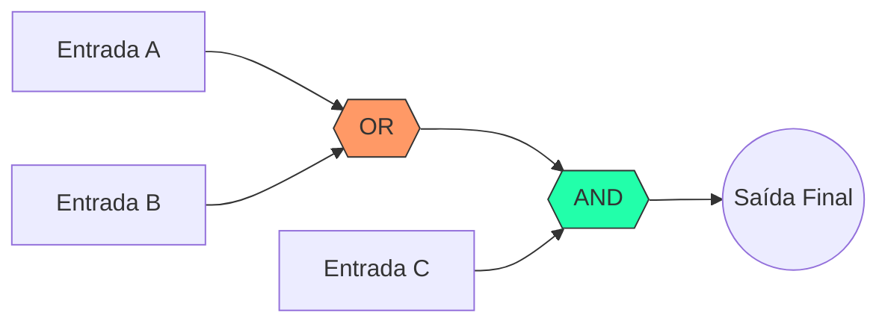

---
tags:
  - Logica-Digital
  - Booleana
  - Logica
---

# 🧠 Aula 09 – Lógica Booleana

Até agora, tratamos os bits (0 e 1) como números. Mas o poder real do computador surge quando tratamos esses bits como **Valores Lógicos**: Falso (0) ou Verdadeiro (1). Vamos aprender como a **Lógica Booleana** permite que o computador tome decisões e controle sistemas complexos.

---

## 🎯 Objetivos de Aprendizagem

Nesta aula, você vai:
- [x] Compreender os valores lógicos: Verdadeiro (1) e Falso (0).
- [x] Conhecer e aplicar os operadores fundamentais: **NOT**, **AND** e **OR**.
- [x] Aprender a ler e construir Tabelas Verdade básicas.
- [x] Entender a prioridade das operações lógicas.

---

## ⚙️ Os Três Pilares da Lógica

Para combinar estados e tomar decisões, usamos três operadores básicos:

=== "NOT (NÃO)"
    **O Inversor**: Inverte qualquer estado. Se entra 1, sai 0. Se entra 0, sai 1.
    
    | Entrada (A) | Saída (¬A) |
    | :---: | :---: |
    | 0 | 1 |
    | 1 | 0 |
=== "AND (E)"
    **A Conjunção**: Só é verdadeira se **AMBAS** as entradas forem verdadeiras.
    
    | A | B | Saída (A ∧ B) |
    | :---: | :---: | :---: |
    | 1 | 1 | **1** |
    | 1 | 0 | 0 |
=== "OR (OU)"
    **A Disjunção**: É verdadeira se **AO MENOS UMA** das entradas for verdadeira.
    
    | A | B | Saída (A ∨ B) |
    | :---: | :---: | :---: |
    | 0 | 0 | 0 |
    | 1 | 0 | **1** |

---

## 📊 Fluxo de Decisão

Veja como uma expressão como `(A OR B) AND C` pode ser visualizada em um fluxo lógico:

---

!!! important "Ordem de Precedência"
    Assim como na matemática, existe uma hierarquia na lógica:
    1. **NOT** (Inversão)
    2. **AND** (Conjunção)
    3. **OR** (Disjunção)
    
    **Dica**: Sempre use parênteses `( )` para garantir que o computador entenda a ordem que você deseja!

---

## 🚀 Desafio da Semana

Tente encontrar um exemplo de lógica "OU" no seu dia a dia.
- Exemplo: "Só vou ao cinema se for sábado **OU** domingo".
- Como você escreveria isso como uma expressão booleana?

---

-   :material-presentation: **Slides Interativos**
    ---
    Animações das portas lógicas e fluxos de decisão.
    [:octicons-arrow-right-24: Ver Slides](../slides/slide-09.html)

-   :material-school: **Quiz de Prática**
    ---
    10 desafios para testar seu raciocínio lógico rápido.
    [:octicons-arrow-right-24: Responder Quiz](../quizzes/quiz-09.md)

-   :material-dumbbell: **Mão na Massa**
    ---
    Exercícios de construção de tabelas verdade.
    [:octicons-arrow-right-24: Praticar](../exercicios/exercicio-09.md)

---
[« Aula Anterior](aula-08.md) | [Próxima Aula: Tabelas Verdade :material-arrow-right:](aula-10.md)
