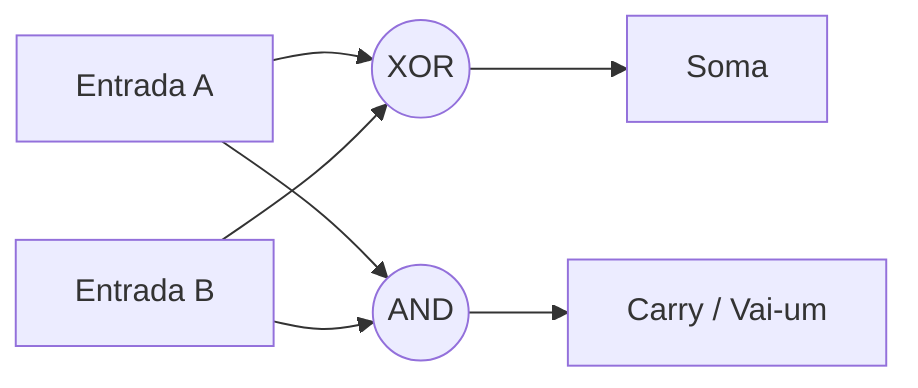

# 🔌 Aula 11 – Circuitos Lógicos

Como transformamos matemática booleana (E, OU, NÃO) em algo físico que funciona com eletricidade? Hoje vamos conhecer as **Portas Lógicas** (*Gates*). Elas são os blocos fundamentais de construção de qualquer chip, do processador do seu celular até o supercomputador da NASA.

---

## 🎯 Objetivos de Aprendizagem

Nesta aula, você vai:
-   [x] Identificar os símbolos internacionais das portas lógicas (**NOT, AND, OR, XOR**).
-   [x] Entender como sinais elétricos (0V e 5V) representam bits.
-   [x] Compreender o funcionamento de um **Somador Binário** (*Half Adder*).
-   [x] Visualizar como portas lógicas se combinam para formar circuitos complexos.

---

## 🏗️ Simbologia das Portas Lógicas

Os engenheiros usam símbolos padrões (ANSI/IEEE) para desenhar circuitos. Aprender esses símbolos é como aprender a ler partituras musicais para computação.

| Porta | Símbolo Visual | Função Lógica |
| :--- | :---: | :--- |
| **NOT** | 🔽 (Triângulo + Bolinha) | Inverte o sinal. |
| **AND** | 🔲 (D-Shape) | Saída 1 se Ambos forem 1. |
| **OR** | 🔼 (Seta/Foguete) | Saída 1 se Pelo Menos um for 1. |
| **XOR** | 🔁 (OR + Traço extra) | Saída 1 se forem Diferentes. |

---

## ⚡ Como o Computador Soma? (Half Adder)

Para somar $1+1$, o computador usa um circuito chamado **Meio Somador**. Ele utiliza duas portas lógicas em paralelo:

1.  **XOR**: Calcula o resultado da soma (se $1+1$, o XOR dá 0).
2.  **AND**: Calcula o "vai-um" ou *Carry* (se $1+1$, o AND dá 1).

---

## 🔬 Transistores: Os Átomos do Hardware

Cada porta lógica que desenhamos é, na verdade, um conjunto de **Transistores**.

-   Um transistor funciona como um interruptor eletrônico ultrarrápido.
-   Quando combinamos 2 ou 4 transistores, criamos uma porta **NAND** ou **NOR**.
-   Um processador moderno (como o i9 ou M2) possui **bilhões** desses transistores em um espaço menor que uma unha.

> [!NOTE]
> "O silício é uma areia que aprendeu a pensar através de portas lógicas."

---

## ✍️ Exercícios Rápidos

1. Qual o nome da porta lógica que inverte o sinal de entrada?
2. Se ligarmos as entradas `1` e `1` em uma porta **XOR**, qual será a saída?
3. Por que a porta **NAND** é chamada de "porta universal"? (Dica: pesquise se é possível construir um AND usando apenas NANDs).

---

## 🚀 Desafio da Semana
Procure uma imagem da placa mãe de um computador antigo (anos 80/90). Tente identificar pequenos chips retangulares com números como `7408` ou `7432`. Esses eram chips que continham apenas algumas portas lógicas individuais!

---

[:material-presentation: Ver Slides](lesson-11-slides){ .md-button }
[:material-school: Responder Quiz](quiz-11){ .md-button }
[:material-dumbbell: Praticar Exercícios](exercicio-11){ .md-button }

---
[« Aula Anterior](aula-10.md) | [Próxima Aula »](aula-12.md)
