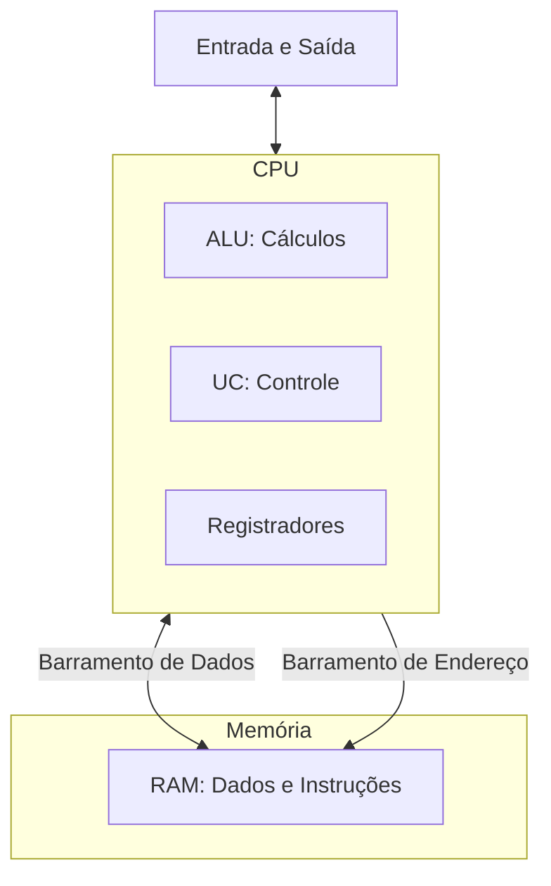
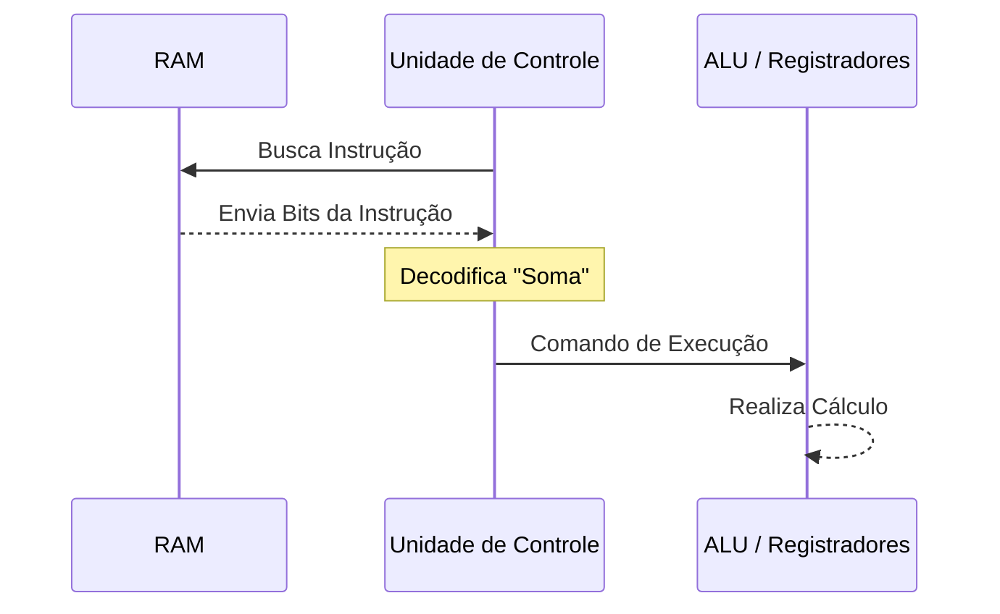

# 🏛️ Aula 12 – Arquitetura de Computadores

Como os bits e as portas lógicas se organizam para formar um computador completo? Hoje vamos conhecer a **Arquitetura de Von Neumann**, o projeto básico que define 99% dos computadores que existem hoje, desde o seu relógio digital até os servidores mais potentes da nuvem.

---

## 🎯 Objetivos de Aprendizagem

Nesta aula, você vai:
-   [x] Compreender os pilares do **Modelo de Von Neumann**.
-   [x] Identificar os componentes da CPU: **ALU**, **UC** e **Registradores**.
-   [x] Entender o **Ciclo de Instrução** (Busca, Decodificação e Execução).
-   [x] Conhecer o papel dos barramentos (*Buses*) na comunicação interna.

---

## 📑 O Modelo de Von Neumann

Em 1945, John von Neumann propôs uma ideia revolucionária: os dados e o programa (instruções) deveriam ser guardados na **mesma memória**. Antes disso, para mudar o programa, era preciso mudar os fios do computador!

---

## 🧠 A CPU e o Ciclo de Vida

A CPU (Unidade Central de Processamento) é o motor do computador. Ela repete um ciclo infinito de três passos:

1.  **Busca (Fetch)**: Pega a próxima instrução na memória RAM.
2.  **Decodifica (Decode)**: A Unidade de Controle entende o que precisa ser feito.
3.  **Executa (Execute)**: A ALU realiza o cálculo ou move o dado.

---

## 🛣️ Barramentos: As Rodovias Digitais

Nenhum componente funciona isolado. Eles se comunicam através de trilhas chamadas **Barramentos** (*Buses*):

-   **Barramento de Dados**: Carrega a informação real (os bits do seu arquivo).
-   **Barramento de Endereço**: Identifica **AONDE** o dado deve ir na memória.
-   **Barramento de Controle**: Gerencia quem pode falar e quem deve ouvir.

> [!TIP]
> O "Gargalo de Von Neumann" acontece porque a CPU é bilhões de vezes mais rápida que a Memória RAM, criando uma fila de espera para os dados chegarem.

---

## ✍️ Exercícios Rápidos

1. Quais são as três partes principais da CPU?
2. O que acontece se a Unidade de Controle (UC) não conseguir decodificar uma instrução?
3. Explique a diferença entre o barramento de Dados e o de Endereço.

---

## 🚀 Desafio da Semana
Abra o "Gerenciador de Tarefas" (Windows) ou o "Monitor de Atividade" (macOS). Observe o gráfico da CPU. Tente identificar a velocidade (em GHz). Você sabia que 3.0 GHz significa que a CPU realiza **3 bilhões** de ciclos de busca-execução por segundo?

---

[:material-presentation: Ver Slides](lesson-12-slides){ .md-button }
[:material-school: Responder Quiz](quiz-12){ .md-button }
[:material-dumbbell: Praticar Exercícios](exercicio-12){ .md-button }

---
[« Aula Anterior](aula-11.md) | [Próxima Aula »](aula-13.md)
