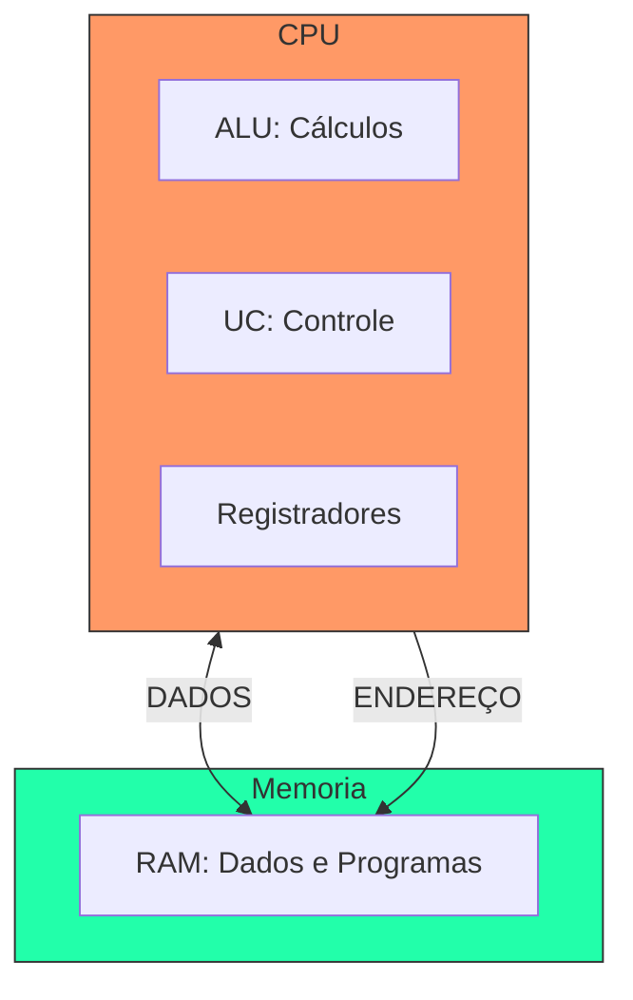

# 🏛️ Aula 12 – Arquitetura de Computadores

Como bits e portas lógicas se organizam para formar um computador completo? Hoje vamos conhecer a **Arquitetura de Von Neumann**, o projeto básico que define 99% dos computadores modernos, do seu relógio digital aos servidores da nuvem.

---

## 🎯 Objetivos de Aprendizagem

Nesta aula, você vai:
- [x] Compreender os pilares do **Modelo de Von Neumann**.
- [x] Identificar os componentes da CPU: **ALU**, **UC** e **Registradores**.
- [x] Entender o **Ciclo de Instrução** (Busca, Decodificação e Execução).
- [x] Conhecer o papel dos barramentos (*Buses*) na comunicação interna.

---

## 📑 O Modelo de Von Neumann

Em 1945, John von Neumann propôs uma ideia revolucionária: dados e programas deveriam ser guardados na **mesma memória**. Antes disso, para mudar o programa, era preciso "trocar os fios" do computador!

---

## 🧠 Ciclo de Vida do Processamento

A CPU repete um ciclo infinito de três passos para cada comando que você executa:

=== "1. Busca (Fetch)"
    Pega a próxima instrução que está esperando na memória RAM e traz para "dentro" do processador.
=== "2. Decodifica (Decode)"
    A **Unidade de Controle** traduz aqueles bits em uma ação real (ex: "Isso é uma soma").
=== "3. Executa (Execute)"
    A **ALU** realiza o cálculo matemático e o resultado é guardado nos registradores.

---

!!! tip "O Gargalo do Barramento"
    Muitas vezes seu computador trava não porque a CPU é lenta, mas porque os **Barramentos** (as rodovias de dados) estão congestionados. A memória RAM é muito mais lenta que o processador, criando uma "fila de espera" digital.

---

## 🚀 Desafio da Semana

Abra o **Gerenciador de Tarefas** (ou Monitor de Atividade). 
- Observe a velocidade da sua CPU em **GHz**. 
- Você sabia que 3.0 GHz significa que ela realiza **3 bilhões** de ciclos de busca-execução por segundo?

---

-   :material-presentation: **Slides Interativos**
    ---
    Animação detalhada do Ciclo de Instrução e fluxo de barramentos.
    [:octicons-arrow-right-24: Ver Slides](../slides/slide-12.html)

-   :material-school: **Quiz de Prática**
    ---
    10 questões sobre Von Neumann e componentes da CPU.
    [:octicons-arrow-right-24: Responder Quiz](../quizzes/quiz-12.md)

-   :material-dumbbell: **Mão na Massa**
    ---
    Atividade sobre afunilamento de memória e barramentos.
    [:octicons-arrow-right-24: Praticar](../exercicios/exercicio-12.md)

---
[« Aula Anterior](aula-11.md) | [Módulo 4: Algoritmos e Programação :material-arrow-right:](aula-13.md)
