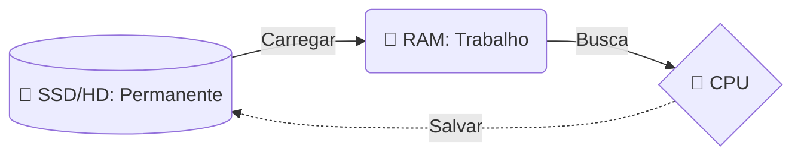

# 💾 Aula 13 – Memória e Armazenamento

Por que o seu computador "esquece" o que você estava fazendo quando a bateria acaba? Por que um SSD faz o seu sistema ligar em segundos, enquanto um HD antigo demora minutos? Hoje vamos desvendar os mistérios da **Memória e Armazenamento**, entendendo como os dados são guardados de forma temporária e permanente.

---

## 🎯 Objetivos de Aprendizagem

Nesta aula, você vai:
-   [x] Diferenciar Memória Primária (Volátil) de Secundária (Não-Volátil).
-   [x] Compreender a **Hierarquia de Memória** (Velocidade vs Custo).
-   [x] Comparar as tecnologias **RAM**, **SSD** e **HD**.
-   [x] Entender o conceito de **Memória Virtual** e **Swap**.
-   [x] Aprender as unidades de medida (KB, MB, GB, TB) e o padrão **KiB**.

---

## 🏗️ Hierarquia de Memória

Nem toda memória é igual. Existe um equilíbrio constante entre **Velocidade**, **Capacidade** e **Custo**.

| Tipo | Localização | Velocidade | Volátil? | Capacidade |
| :--- | :--- | :--- | :---: | :--- |
| **Registradores** | Dentro da CPU | Ultra Rápida | Sim | Bytes |
| **Cache (L1/L2)** | Perto da CPU | Muito Rápida | Sim | MegaBytes |
| **RAM** | Placa Mãe | Rápida | **Sim** | GigaBytes |
| **SSD / HD** | Armazenamento | Lenta | **Não** | TeraBytes |

---

## ⚡ Memória RAM vs Armazenamento

Imagine que você está cozinhando:
-   A **RAM** é o espaço em cima da sua mesa (onde você coloca os ingredientes que está usando agora).
-   O **Armazenamento (SSD/HD)** é o armário (onde você guarda tudo para usar outro dia).

---

## 🚀 SSD vs HD: O Fim da Mecânica

-   **HD (Hard Disk Drive)**: Usa discos magnéticos giratórios e uma agulha física. É lento porque depende de movimento mecânico.
-   **SSD (Solid State Drive)**: Usa chips de memória flash. É puramente eletrônico, muito mais rápido e resistente a impactos.

> [!TIP]
> Trocar um HD antigo por um SSD é o "upgrade" mais eficiente que você pode fazer em um computador para ganhar velocidade imediata.

---

## 🧱 Memória Virtual (Paging)

O que o computador faz quando você abre 50 abas no navegador e sua RAM acaba? Ele usa uma técnica chamada **Memória Virtual**.

1.  O Sistema Operacional reserva um espaço no SSD/HD.
2.  Os programas que você não está usando no momento são "movidos" para esse espaço.
3.  Isso evita que o PC trave, mas torna o sistema muito mais lento.

---

## 📏 Unidades de Medida e a Confusão dos 1024

Na escola, aprendemos que $1\text{ kilo} = 1.000$. Mas na informática:

$$ 1\text{ KiB (Kibibyte)} = 1.024\text{ Bytes} $$

Isso acontece porque os computadores trabalham em bases de 2 ($2^{10} = 1024$). Fabricantes de HD vendem usando 1.000, mas o Windows lê usando 1.024. É por isso que seu HD de 1 TB sempre parece ter menos espaço quando você o liga!

---

## ✍️ Exercícios Rápidos

1. O que acontece com os dados na memória RAM quando você desliga o computador?
2. Por que a memória Cache é necessária se já temos a RAM?
3. Qual a diferença principal entre um KiB e um KB?

---

## 🚀 Desafio da Semana
Descubra quanta memória RAM o seu computador possui e quanto espaço está livre no seu SSD/HD. Tente descobrir também qual a tecnologia do seu disco principal (SATA ou NVMe).

---

[:material-presentation: Ver Slides](lesson-13-slides){ .md-button }
[:material-school: Responder Quiz](quiz-13){ .md-button }
[:material-dumbbell: Praticar Exercícios](exercicio-13){ .md-button }

---
[« Aula Anterior](aula-12.md) | [Próxima Aula »](aula-14.md)
