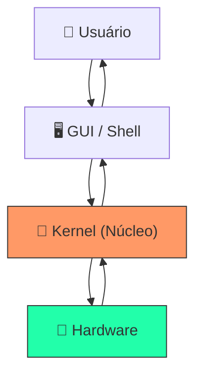

# 🖥️ Aula 14 – Sistemas Operacionais

Como o seu computador consegue rodar um navegador, um editor e um player ao mesmo tempo sem que eles se "atropelem"? O responsável é o **Sistema Operacional (SO)**, o grande gerente de recursos da máquina.

---

## 🎯 Objetivos de Aprendizagem

Nesta aula, você vai:
- [x] Compreender o papel do SO como intermediário entre hardware e software.
- [x] Conhecer as camadas do sistema: **Kernel**, **Shell** e **GUI**.
- [x] Entender as funções de gerência (Processos, Memória e Arquivos).
- [x] Diferenciar o uso de interfaces gráficas (**GUI**) e linhas de comando (**CLI**).

---

## 🏗️ As Camadas do Sistema

Um computador funciona em camadas. Você raramente toca o hardware; você interage com as camadas superiores.



---

## 📂 Interfaces e Controle

=== "GUI (Interface Gráfica)"
    É a interface clássica com mouse, janelas e ícones. Ideal para a maioria das tarefas diárias e usuários iniciantes.
=== "CLI (Linha de Comando)"
    O famoso terminal. Ferramenta favorita de desenvolvedores pela velocidade e poder de **automação**.
    
    <div class="termy">
    ```console
    $ ls -l /documents
    $ cd /projects/ads
    $ echo "Iniciando estudos de SO..." > log.txt
    ```
    </div>

---

!!! important "O Coração: Kernel"
    O **Kernel** é a parte que fica carregada na memória o tempo todo. Ele decide qual programa usa a CPU, garante que um app não apague os dados de outro e conversa com dispositivos através dos **Drivers**.

---

## 🚀 Desafio da Semana

Abra o Terminal do seu sistema (**Prompt/PowerShell** ou **Terminal**). 
- Use o comando `dir` (Windows) ou `ls` (Linux/Mac) para ver onde você está.
- Tente criar uma pasta e entrar nela apenas usando comandos!

---

<div class="grid cards" markdown>

-   :material-presentation: **Slides Interativos**
    ---
    Animação das camadas de Kernel e demonstração de Shell.
    [:octicons-arrow-right-24: Ver Slides](../slides/slide-14.html)

-   :material-school: **Quiz de Prática**
    ---
    Teste seus conhecimentos sobre Kernel e Sistemas de Arquivos.
    [:octicons-arrow-right-24: Responder Quiz](../quizzes/quiz-14.md)

-   :material-dumbbell: **Mão na Massa**
    ---
    Atividades práticas de Linha de Comando básica.
    [:octicons-arrow-right-24: Praticar](../exercicios/exercicio-14.md)

</div>

---
[« Aula Anterior](aula-13.md) | [Módulo 4: Algoritmos e Programação :material-arrow-right:](aula-15.md)
