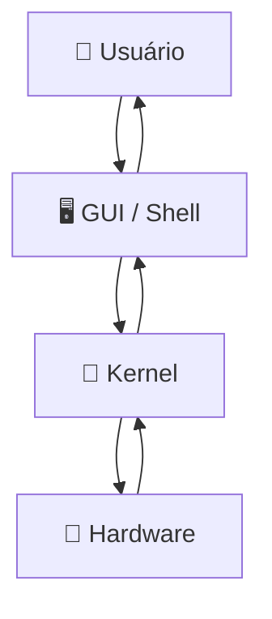

# 🖥️ Aula 14 – Sistemas Operacionais

Você já parou para pensar em como o seu computador consegue rodar um navegador, um editor de textos e um player de música ao mesmo tempo sem que eles se "atropelem"? O responsável por essa mágica é o **Sistema Operacional (SO)**. Hoje vamos entender como ele atua como o grande gerente de todos os recursos da máquina.

---

## 🎯 Objetivos de Aprendizagem

Nesta aula, você vai:
-   [x] Compreender o papel do SO como intermediário entre hardware e software.
-   [x] Conhecer as camadas do sistema: **Kernel**, **Shell** e **GUI**.
-   [x] Entender as funções de gerência (Processos, Memória e Arquivos).
-   [x] Diferenciar o uso de interfaces gráficas (**GUI**) e linhas de comando (**CLI**).

---

## 🏗️ As Camadas do Sistema

Um computador funciona como uma cebola, cheia de camadas. O usuário raramente toca o hardware diretamente; ele interage com as camadas superiores.



---

## 🧠 O Kernel: O Coração do SO

O **Kernel** é a parte do sistema operacional que fica carregada na memória o tempo todo. Ele é o "chefe" invisível que toma as decisões críticas:

-   **Gerência de Processos**: Decide qual programa pode usar a CPU agora.
-   **Gerência de Memória**: Garante que o navegador não apague os dados da sua planilha.
-   **Gerência de Dispositivos**: Conversa com impressoras, teclados e placas de vídeo através dos **Drivers**.

---

## ⌨️ CLI vs GUI: Duas Formas de dar Ordens

-   **GUI (Graphical User Interface)**: É a interface clássica com mouse, janelas e ícones. Ideal para a maioria dos usuários.
-   **CLI (Command Line Interface)**: É o famoso terminal ou prompt de comando. É a ferramenta favorita de desenvolvedores pela sua velocidade e poder de automação.

<div class="termy">
```console
$ ls -l /documents
total 12
-rw-r--r--  1 ads  prof  1024 Feb 20 10:00 aula_so.pdf
-rw-r--r--  1 ads  prof  2048 Feb 21 09:30 resumo.txt

$ cd /documents
$ echo "Aprendendo Sistemas Operacionais" > estudo.txt
```
</div>

---

## 📂 Sistemas de Arquivos

Cada SO tem sua forma preferida de organizar os bits no disco (o índice do livro).

-   **NTFS**: Padrão do Windows. Robusto e com permissões complexas.
-   **EXT4**: Padrão do Linux. Muito rápido e estável.
-   **FAT32**: Antigo, mas funciona em qualquer lugar (pendrives e câmeras).

> [!IMPORTANT]
> Um arquivo deletado muitas vezes não "some" do disco imediatamente. O SO apenas remove a referência dele no Sistema de Arquivos, marcando aquele espaço como "disponível para novos dados".

---

## ✍️ Exercícios Rápidos

1. Qual a função de um **Driver** de dispositivo?
2. Por que o Kernel é considerado a parte mais crítica de um SO?
3. Cite uma vantagem de usar a Linha de Comando (CLI) em vez da Interface Gráfica (GUI).

---

## 🚀 Desafio da Semana
Abra o Terminal do seu sistema (Prompt/PowerShell no Windows ou Terminal no Linux/Mac) e digite o comando para listar diretórios (`dir` no Windows ou `ls` nos outros). Tente navegar entre pastas apenas usando comandos!

---

[:material-presentation: Ver Slides](lesson-14-slides){ .md-button }
[:material-school: Responder Quiz](quiz-14){ .md-button }
[:material-dumbbell: Praticar Exercícios](exercicio-14){ .md-button }

---
[« Aula Anterior](aula-13.md) | [Próxima Aula »](aula-15.md)
