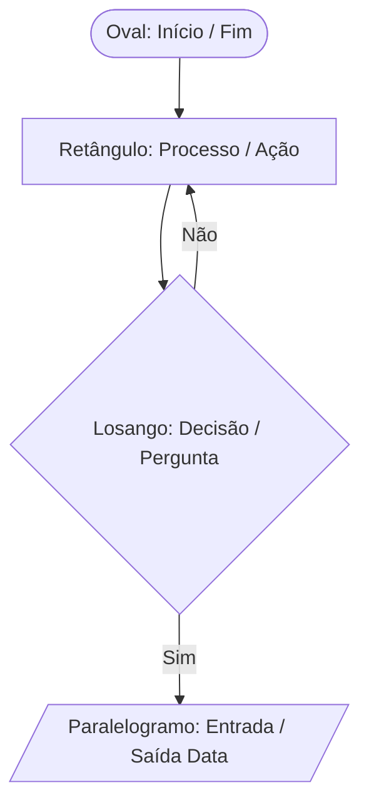

# 📋 Aula 15 – Algoritmos e Fluxogramas

Até agora, aprendemos sobre o "corpo" do computador (hardware) e o seu "cérebro" (SO). Agora, vamos aprender a dar ordens inteligentes para ele. Programar não é apenas escrever códigos complicados; programar é **resolver problemas**. Hoje vamos aprender como planejar essas soluções usando **Algoritmos** e **Fluxogramas**.

---

## 🎯 Objetivos de Aprendizagem

Nesta aula, você vai:
-   [x] Definir o que é um algoritmo e suas propriedades fundamentais.
-   [x] Identificar e utilizar a simbologia padrão de **Fluxogramas**.
-   [x] Compreender a lógica de **Desvio Condicional** (SE / ENTÃO / SENÃO).
-   [x] Transformar um problema do cotidiano em uma sequência lógica de passos.

---

## 🧩 O que é um Algoritmo?

Um algoritmo é simplesmente uma **sequência finita de passos** claros e bem definidos para realizar uma tarefa.

-   Uma receita de bolo é um algoritmo.
-   As instruções para montar um móvel são um algoritmo.
-   O caminho que o GPS calcula é um algoritmo.

---

## 📊 Simbologia de Fluxogramas

Para que programadores do mundo todo se entendam, existem símbolos padrões para desenhar algoritmos:



---

## 🚦 Lógica de Decisão (A Bifurcação)

A parte mais importante de um algoritmo é a capacidade de tomar decisões com base em condições.

!!! quote "Estrutura SE-ENTÃO-SENÃO"
    **SE** (a média for maior que 7)
       **ENTÃO** { Aluno Aprovado }
    **SENÃO**
       { Aluno em Recuperação }

---

## 🔍 Exemplo Prático: Saque Bancário

Como o caixa eletrônico decide se te entrega o dinheiro?

<div class="termy">
```console
$ run-algorithm "Saque Bancário"
1. Início
2. Ler VALOR_SAQUE
3. Ler SALDO_DISPONIVEL
4. SE (VALOR_SAQUE <= SALDO_DISPONIVEL)
      ENTÃO: Subtrair valor e Entregar Notas
      SENÃO: Mostrar "Saldo Insuficiente"
5. Fim
```
</div>

---

## 💡 Dica de Ouro: Pseudocódigo

Antes de tentar escrever em Python, C ou Java, escreva em **Portugol** (Português Estruturado). Se a lógica funcionar no papel, ela funcionará em qualquer linguagem de programação!

> [!TIP]
> Um programa mal planejado é como uma casa construída sem planta: você vai gastar o dobro do tempo consertando erros no futuro.

---

## ✍️ Exercícios Rápidos

1. Qual a diferença entre um Processo (Retângulo) e uma Decisão (Losango) em um fluxograma?
2. Por que um algoritmo deve ser "finito"?
3. Monte o algoritmo para "Trocar uma Lâmpada queimada".

---

## 🚀 Desafio da Semana
Desenhe o fluxograma de um sistema de login: ele deve perguntar o usuário e a senha. Se ambos estiverem corretos, mostra "Bem-vindo"; caso contrário, mostra "Erro" e termina.

---

[:material-presentation: Ver Slides](lesson-15-slides){ .md-button }
[:material-school: Responder Quiz](quiz-15){ .md-button }
[:material-dumbbell: Praticar Exercícios](exercicio-15){ .md-button }

---
[« Aula Anterior](aula-14.md) | [Próxima Aula »](aula-16.md)
