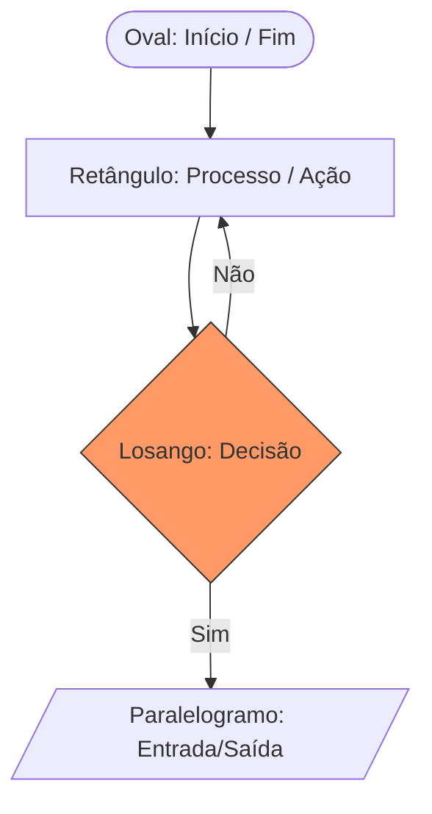

# 📋 Aula 15 – Algoritmos e Fluxogramas

Até agora, aprendemos sobre o "corpo" do computador (hardware) e o seu "cérebro" (SO). Agora, vamos aprender a dar ordens inteligentes para ele. Programar é, antes de tudo, **resolver problemas**.

---

## 🎯 Objetivos de Aprendizagem

Nesta aula, você vai:
- [x] Definir o que é um algoritmo e suas propriedades fundamentais.
- [x] Identificar e utilizar a simbologia padrão de **Fluxogramas**.
- [x] Compreender a lógica de **Desvio Condicional** (SE / ENTÃO / SENÃO).
- [x] Transformar um problema do cotidiano em uma sequência lógica.

---

## 🧩 O que é um Algoritmo?

Um algoritmo é simplesmente uma **sequência finita de passos** claros e bem definidos para realizar uma tarefa.

=== "Exemplos Reais"
    - Uma receita de bolo.
    - Instruções para montar um móvel.
    - O caminho que o GPS calcula.
=== "Propriedades"
    1. **Finitude**: Deve ter um fim.
    2. **Clareza**: Cada passo deve ser inequívoco.
    3. **Eficácia**: Deve resolver o problema proposto.

---

## 📊 Simbologia de Fluxogramas

Para que desenvolvedores do mundo todo se entendam, usamos símbolos padrões:

---

!!! tip "Dica de Ouro: Pseudocódigo"
    Antes de escrever em códigos complicados, escreva em **Portugol** (Português Estruturado). Se a lógica funcionar no papel, ela funcionará em qualquer linguagem de programação!

---

## 🚀 Desafio da Semana

Desenhe o fluxograma de um sistema de login simples.
- Ele deve perguntar o usuário e a senha. 
- **SE** ambos estiverem corretos, mostra "Bem-vindo". 
- **SENÃO**, mostra "Erro" e termina.

---

-   :material-presentation: **Slides Interativos**
    ---
    Veja a construção passo a passo de fluxogramas complexos.
    [:octicons-arrow-right-24: Ver Slides](../slides/slide-15.html)

-   :material-school: **Quiz de Prática**
    ---
    Identifique erros de lógica em algoritmos do dia a dia.
    [:octicons-arrow-right-24: Responder Quiz](../quizzes/quiz-15.md)

-   :material-dumbbell: **Mão na Massa**
    ---
    Exercícios de criação de algoritmos para problemas reais.
    [:octicons-arrow-right-24: Praticar](../exercicios/exercicio-15.md)

---
[« Aula Anterior](aula-14.md) | [Última Aula: Introdução à Programação :material-arrow-right:](aula-16.md)
