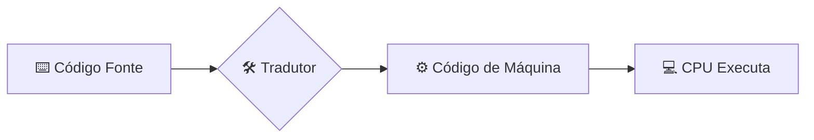

# 🚀 Aula 16 – Introdução à Programação

Chegamos ao ápice da nossa jornada! Percorremos um longo caminho: desde os bits solitários até os complexos sistemas operacionais. Agora, vamos pegar todo esse conhecimento e aplicá-lo na prática mais poderosa de um desenvolvedor: a **Programação**. Hoje vamos entender como transformar ideias em código que o computador obedece.

---

## 🎯 Objetivos de Aprendizagem

Nesta aula, você vai:
-   [x] Compreender o papel das linguagens de programação de alto e baixo nível.
-   [x] Conhecer a diferença entre **Compiladores** e **Interpretadores**.
-   [x] Identificar os blocos básicos de qualquer programa: Variáveis, Laços e Funções.
-   [x] Escrever (ou entender) o seu primeiro "Olá Mundo".

---

## 🏗️ A Jornada do Código

Como o texto que você digita vira pulsos elétricos? Existem dois tradutores principais:

### 1. Compiladores (Ex: C, Rust, Go)
Traduzem o código inteiro de uma vez em um arquivo executável (`.exe`). São muito rápidos na execução, mas demoram um pouco para traduzir.

### 2. Interpretadores (Ex: Python, JavaScript, PHP)
Traduzem o código linha por linha, enquanto o programa roda. São excelentes para aprender e testar ideias rapidamente.



---

## 🦴 Anatomia Básica de um Programa

Não importa a linguagem, quase todas usam os mesmos conceitos fundamentais:

-   **Variáveis**: Gavetas na memória RAM para guardar dados (números, nomes, etc).
-   **Estruturas de Decisão**: O `SE` que aprendemos na aula anterior.
-   **Estruturas de Repetição (Loops)**: Comandos que fazem o computador repetir algo 1.000 ou 1 milhão de vezes sem cansar.
-   **Funções**: Blocos de código reaproveitáveis (atalhos).

---

## 🌎 Tradição: "Olá, Mundo!"

Todo programador começa por aqui. Veja como o mesmo comando muda conforme a linguagem, mas o objetivo é o mesmo:

=== "Python"
    ```python
    print("Olá, Mundo!")
    ```

=== "JavaScript"
    ```javascript
    console.log("Olá, Mundo!");
    ```

=== "C"
    ```c
    #include <stdio.h>
    int main() {
       printf("Olá, Mundo!");
       return 0;
    }
    ```

---

## 🎓 A Grande Revisão: Você agora entende!

Pense em tudo o que você aprendeu para chegar até aqui:
1.  **Bit e Byte**: O alfabeto da máquina.
2.  **Lógica Booleana**: As regras do pensamento digital.
3.  **Circuitos e CPU**: Como o silício executa ordens.
4.  **Sistemas Operacionais**: Como gerenciar milhares de ordens ao mesmo tempo.
5.  **Programação**: Como você assume o controle!

---

## 🚀 Onde Ir daqui?

Fundamentos da Computação é apenas o começo. Com essa base sólida, você está pronto para:
-   **Desenvolvimento Web**: Aprender HTML, CSS e JS.
-   **Ciência de Dados**: Aprender Python e Estatística.
-   **Desenvolvimento de Apps**: Aprender Swift, Kotlin ou Flutter.

> [!TIP]
> Não tente aprender todas as linguagens ao mesmo tempo. Escolha uma, pratique a lógica e o resto virá naturalmente!

---

## 🏁 Conclusão do Curso
Parabéns! Você concluiu os **Fundamentos da Computação**. Agora você não apenas usa o computador, você entende o que acontece "por baixo do capô". A computação deixou de ser mágica e passou a ser uma ferramenta em suas mãos.

---

[:material-presentation: Ver Slides](lesson-16-slides){ .md-button }
[:material-school: Responder Quiz](quiz-16){ .md-button }
[:material-dumbbell: Praticar Exercícios](exercicio-16){ .md-button }

---
[« Aula Anterior](aula-15.md)
