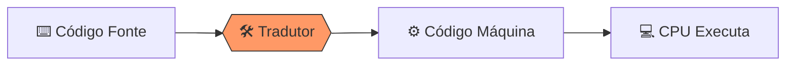

---
tags:
  - Programacao
  - Introducao
  - Algoritmos
---

# 🚀 Aula 16 – Introdução à Programação

Chegamos ao ápice da nossa jornada! Percorremos um longo caminho: desde os bits solitários até os complexos sistemas operacionais. Agora, vamos aplicar esse conhecimento na prática: a **Programação**.

---

## 🎯 Objetivos de Aprendizagem

Nesta aula, você vai:
- [x] Compreender o papel das linguagens de alto e baixo nível.
- [x] Conhecer a diferença entre **Compiladores** e **Interpretadores**.
- [x] Identificar os blocos básicos: Variáveis, Laços e Funções.
- [x] Escrever o seu primeiro "Olá Mundo".

---

## 🏗️ A Jornada do Código

Como o texto que você digita vira pulsos elétricos? Existem dois "tradutores" principais:

=== "Compiladores"
    Traduzem o código **inteiro** de uma vez em um arquivo executável (`.exe`). São muito rápidos na execução.
    - *Exemplos: C, C++, Rust, Go.*
=== "Interpretadores"
    Traduzem o código **linha por linha**, enquanto o programa roda. São ótimos para testes rápidos.
    - *Exemplos: Python, JavaScript, PHP.*



---

## 🌎 Tradição: "Olá, Mundo!"

Todo programador começa por aqui. Veja como o comando muda, mas o objetivo é o mesmo:

=== "Python"
    ```python
    print("Olá, Mundo!")
    ```
=== "JavaScript"
    ```javascript
    console.log("Olá, Mundo!");
    ```
=== "C"
    ```c
    #include <stdio.h>
    int main() {
       printf("Olá, Mundo!");
       return 0;
    }
    ```

---

!!! tip "Dica para o Sucesso"
    Não tente aprender todas as linguagens ao mesmo tempo. Escolha uma (como Python ou JavaScript), pratique a **Lógica de Programação** e o resto virá naturalmente!

---

## 🏁 Conclusão do Curso

Parabéns! Você concluiu os **Fundamentos da Computação**. Agora você não apenas usa o computador, você entende o que acontece "por baixo do capô". A computação deixou de ser mágica e passou a ser uma ferramenta em suas mãos.

---

<div class="grid cards" markdown>

-   :material-presentation: **Slides de Encerramento**
    ---
    Resumo de toda a jornada e próximos passos na carreira.
    [:octicons-arrow-right-24: Ver Slides](../slides/slide-16.html)

-   :material-school: **Quiz Final**
    ---
    O grande desafio final cobrindo todos os módulos.
    [:octicons-arrow-right-24: Responder Quiz](../quizzes/quiz-16.md)

-   :material-dumbbell: **Projeto Final**
    ---
    Aplique tudo o que aprendeu em um desafio integrado.
    [:octicons-arrow-right-24: Ver Projeto](../projetos/projeto-16.md)

</div>

---
[« Aula Anterior](aula-15.md)
